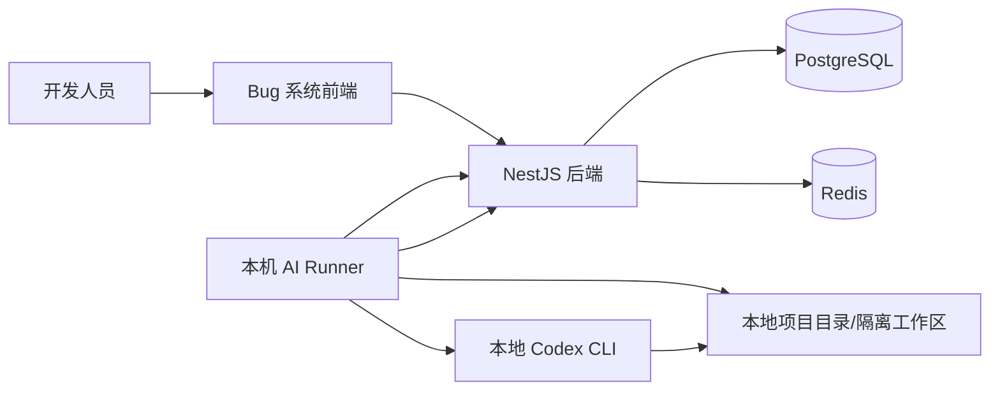
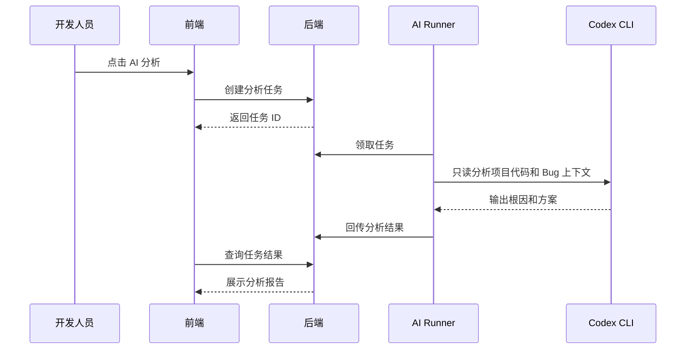
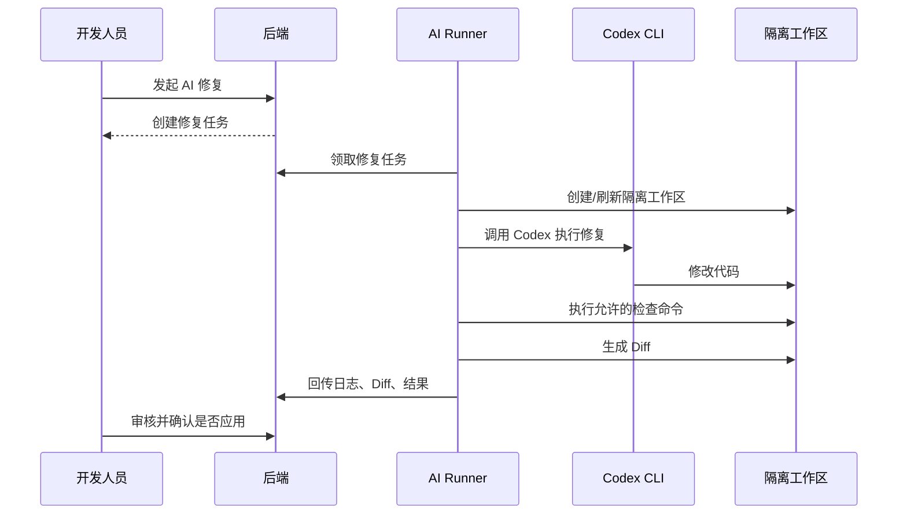

# AI 修复架构设计

最后更新时间：2026-05-15  
当前状态：二期架构规划，第一期不实现  
前置文档：

- [二期AI修复规划.md](../项目管理/二期AI修复规划.md)
- [需求分析.md](../项目管理/需求分析.md)
- [业务流程图.md](./业务流程图.md)

## 1. 架构目标

AI 修复能力用于在二期将 Bug 系统与本机 Codex 串联起来，让开发人员可以基于 Bug 或修复包发起本地代码分析和修复。

架构目标：

1. Bug 系统只负责任务、权限、配置、审计和结果展示。
2. 本机 AI Runner 负责调用本地 Codex 和访问本地项目目录。
3. AI 修复默认在隔离工作区执行，不直接修改主工作区。
4. 修复结果必须通过 Diff 和冲突检测后，由开发人员确认应用。
5. 所有项目路径、命令策略和 Runner 权限必须配置化。

## 2. 推荐总体架构



说明：

1. 前端只和 Bug 系统后端通信。
2. 后端不直接执行本机 Codex。
3. AI Runner 从后端领取任务，并将状态、日志、Diff 回传。
4. Codex CLI 只在 Runner 所在本机执行。
5. Redis 可用于任务队列、状态缓存和实时日志推送。

## 3. 为什么不让 Docker 后端直接调用 Codex

不推荐 Docker 后端直接调用本机 Codex，原因：

1. Docker 容器默认无法安全访问本机多个项目目录。
2. 容器内没有用户本机 Codex 登录态和配置。
3. 后端直接执行命令会扩大攻击面。
4. 多项目路径映射和文件权限难以统一管理。
5. 后续如果有多台开发机，Runner 模式更容易扩展。

因此二期采用“系统下发任务，本机 Runner 执行”的模式。

## 4. AI Runner 职责

AI Runner 是运行在开发者本机的轻量服务，职责包括：

1. 向 Bug 系统注册和心跳。
2. 拉取待执行 AI 任务。
3. 校验任务目标项目是否在允许路径内。
4. 创建或准备隔离工作区。
5. 调用本地 Codex CLI。
6. 采集执行日志、修改文件、Diff 和测试结果。
7. 回传任务状态。
8. 支持取消、超时和失败恢复。

Runner 不负责业务权限判断，业务权限由 Bug 系统后端控制。

## 5. 任务执行模式

### 5.1 AI 分析模式

分析模式只读项目，不改文件。



### 5.2 AI 修复模式

修复模式允许在隔离工作区写入文件。



## 6. 多 Bug 同文件修改策略

### 6.1 独立任务策略

如果多个 Bug 独立修复，每个任务必须有独立工作区。

```text
project/
  ai-worktrees/bug-101/
  ai-worktrees/bug-102/
  ai-worktrees/bug-103/
```

合并前执行 patch 检查：

```bash
git apply --check bug-101.patch
```

检查失败则标记为冲突，不能自动应用。

### 6.2 修复包策略

如果多个 Bug 已知属于同一文件、同一模块或同一流程，应创建 AI 修复包，由 AI 一次性处理。

优点：

1. 只有一个工作区。
2. 只有一份 Diff。
3. 只执行一次测试。
4. 避免多个独立任务互相覆盖。
5. 更符合真实开发中“同模块问题统一修”的习惯。

### 6.3 合并队列策略

二期后续可设计合并队列：

1. 队列按项目维度串行应用 patch。
2. 同一文件但 diff 区域不重叠，可提示低风险自动合并。
3. 同一文件且 diff 区域重叠，必须人工处理。
4. 某任务基线落后时，提示“基于最新代码重新修复”。

## 7. 建议数据模型

### 7.1 ai_runner

| 字段 | 说明 |
|---|---|
| runner_id | Runner ID |
| runner_name | Runner 名称 |
| machine_name | 本机名称 |
| status | 在线、离线、禁用 |
| token_hash | Runner 认证 token 哈希 |
| allowed_paths | 允许访问的路径配置，可 JSON |
| last_heartbeat | 最近心跳时间 |
| create_time | 创建时间 |
| update_time | 更新时间 |

### 7.2 ai_project_repo

| 字段 | 说明 |
|---|---|
| repo_id | 仓库配置 ID |
| bug_project_id | 关联 Bug 项目 ID |
| repo_name | 本地项目名称 |
| local_path | 本地项目路径 |
| repo_type | frontend、backend、fullstack、mobile 等 |
| default_branch | 默认分支 |
| test_command | 默认测试命令 |
| build_command | 默认构建命令 |
| lint_command | 默认检查命令 |
| enabled | 是否启用 |
| remark | 备注 |

### 7.3 ai_fix_task

| 字段 | 说明 |
|---|---|
| task_id | 任务 ID |
| task_no | 任务编号 |
| ticket_id | 关联 Bug，可为空 |
| package_id | 关联修复包，可为空 |
| repo_id | 关联本地项目配置 |
| task_type | analyze、fix、test、apply |
| status | pending、claimed、running、success、failed、cancelled、conflict |
| fix_prompt | 修复说明 |
| acceptance_criteria | 验收标准 |
| analysis_result | 分析结果 |
| changed_files | 修改文件 JSON |
| diff_summary | Diff 摘要 |
| patch_path | patch 文件路径或对象存储地址 |
| log_path | 日志文件路径 |
| created_by | 创建人 |
| runner_id | 执行 Runner |
| started_at | 开始时间 |
| finished_at | 结束时间 |

### 7.4 ai_fix_package

| 字段 | 说明 |
|---|---|
| package_id | 修复包 ID |
| package_no | 修复包编号 |
| title | 修复包标题 |
| bug_project_id | 所属 Bug 项目 |
| repo_id | 本地项目配置 |
| module_name | 目标模块 |
| status | drafting、ready、running、success、failed、applied |
| fix_prompt | 统一修复说明 |
| acceptance_criteria | 统一验收标准 |
| risk_level | 风险等级 |
| created_by | 创建人 |
| assigned_to | 负责人 |
| create_time | 创建时间 |
| update_time | 更新时间 |

### 7.5 ai_fix_package_ticket

| 字段 | 说明 |
|---|---|
| id | 主键 |
| package_id | 修复包 ID |
| ticket_id | Bug ID |
| relation_type | main、related、blocked_by、duplicate、regression |
| sort_order | 排序 |

### 7.6 ai_command_policy

| 字段 | 说明 |
|---|---|
| policy_id | 策略 ID |
| repo_id | 仓库配置 ID |
| allow_install | 是否允许安装依赖 |
| allow_build | 是否允许构建 |
| allow_test | 是否允许测试 |
| allow_git_commit | 是否允许提交 |
| allow_git_push | 是否允许推送 |
| allowed_commands | 允许命令 JSON |
| blocked_commands | 禁止命令 JSON |
| timeout_seconds | 超时时间 |
| enabled | 是否启用 |

## 8. Codex 调用建议

二期 Runner 可通过 Codex CLI 非交互模式执行。

示例：

```bash
codex exec \
  --cd /path/to/isolated-workspace \
  --sandbox workspace-write \
  --ask-for-approval never \
  "根据 Bug 上下文和修复说明完成修复，不要执行 git commit，不要推送代码。"
```

注意：

1. Runner 应根据策略生成 Codex Prompt。
2. Prompt 必须包含项目规则、Bug 信息、修复说明、验收标准、禁止事项。
3. 默认不允许 Codex 自动执行 Git 提交、推送、部署、删除数据。
4. 是否允许安装依赖必须由命令策略决定。

## 9. 安全策略

二期必须实现以下安全控制：

1. 只能选择管理员配置过的本地项目路径。
2. Runner token 必须加密或哈希存储。
3. Runner 与后端通信必须带认证。
4. AI 分析和 AI 修复权限分离。
5. 修复结果默认只生成 Diff，不自动应用。
6. 应用修复前必须执行冲突检查。
7. 默认禁止 git push、强制推送、删除分支、生产部署、数据迁移。
8. 默认禁止修改敏感文件，例如 `.env`、密钥文件、证书文件。
9. 每次执行保存 Prompt、命令、日志、修改文件和结果摘要。
10. 任务必须有超时和取消机制。

## 10. 与一期系统的关系

一期不实现本架构，仅保留文档规划。

一期继续完善：

1. Bug 提交体验。
2. 附件标注和预览。
3. Bug 列表和快捷操作。
4. 菜单数量标签。
5. 角色工作台配置。
6. Docker 本地部署。

二期启动时再新增 AI 模块、AI Runner 和相关页面。
