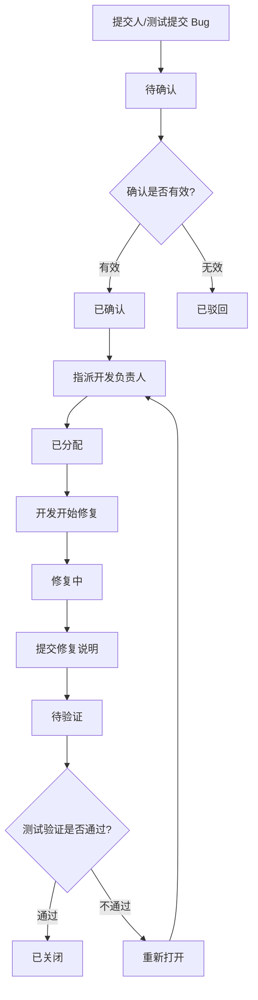
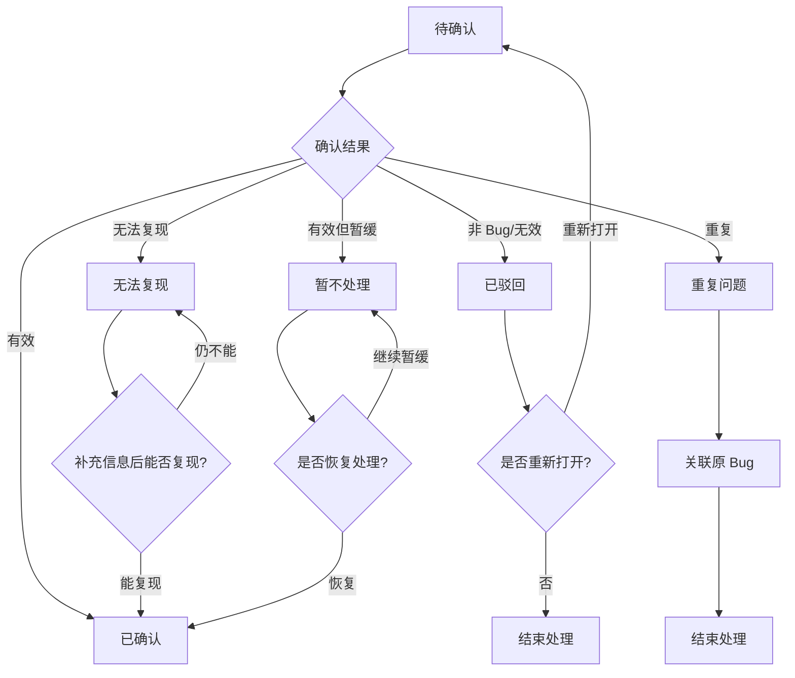
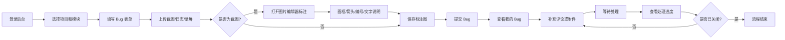
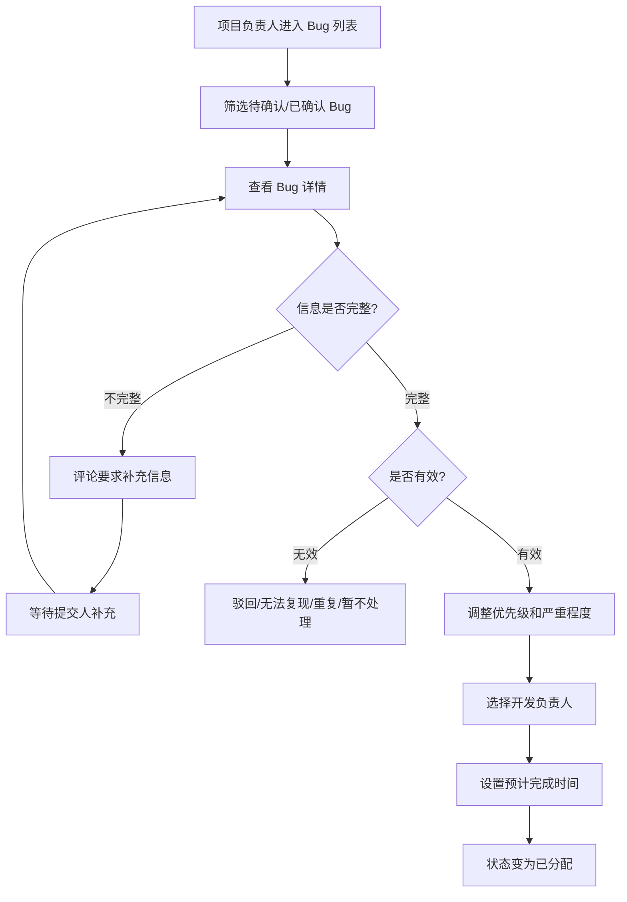
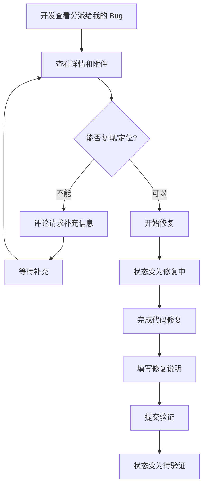
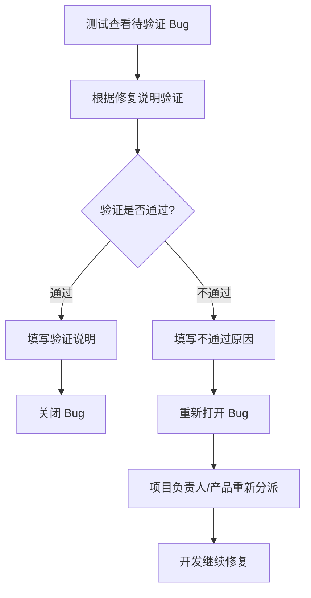
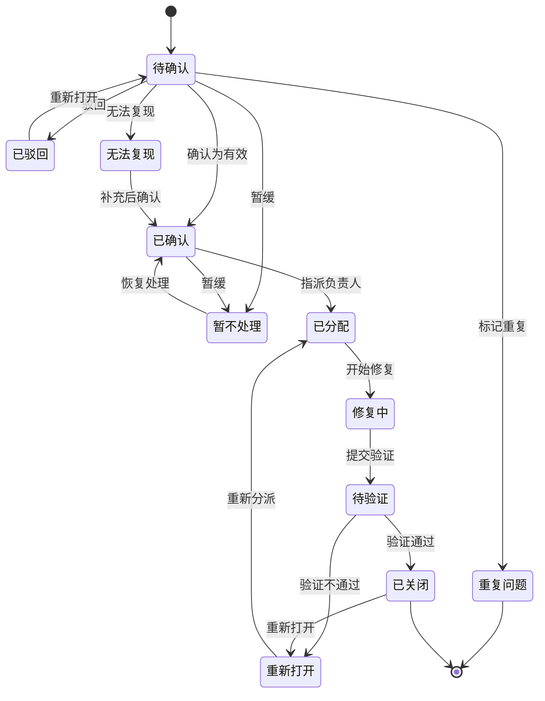
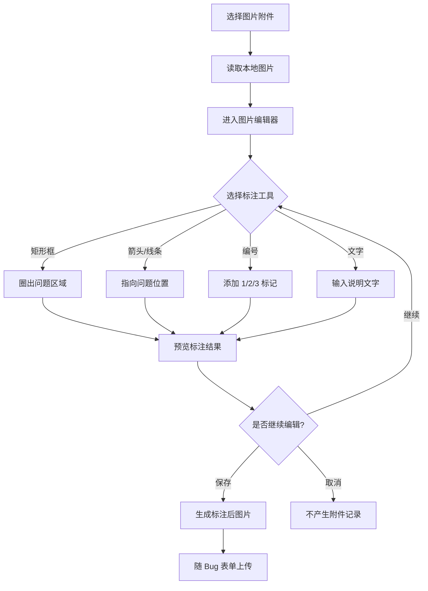
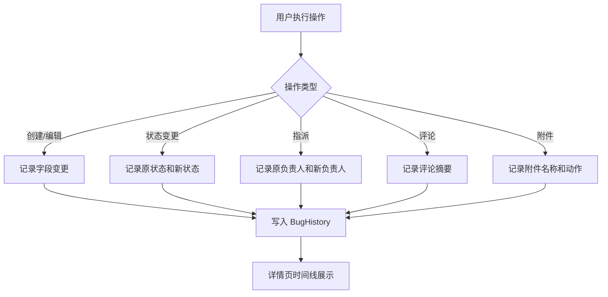
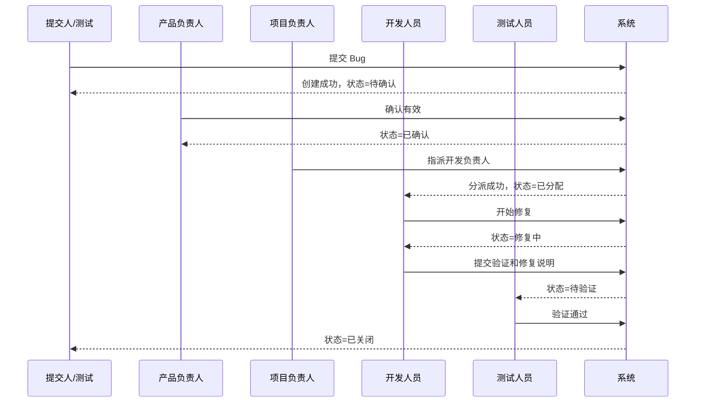

# Bug 反馈系统业务流程图

最后更新时间：2026-05-14  
当前状态：初稿，待确认  
前置文档：

- [需求分析.md](../项目管理/需求分析.md)
- [角色权限设计.md](../项目管理/角色权限设计.md)

## 1. 流程设计目标

本文档用于描述 Bug 反馈系统第一版的核心业务流程、异常流程、角色协作路径和状态变化规则。

本系统面向内部团队使用，支持多个项目，Bug 通过后台登录后提交。第一版不做外部用户入口和消息通知，重点保证流程完整、权限清晰、状态可追踪。

## 2. 核心状态定义

### 2.1 标准状态

| 状态 | 说明 |
|---|---|
| 待确认 | Bug 已提交，等待产品、测试或项目负责人确认 |
| 已确认 | Bug 被确认有效，等待指派处理人 |
| 已分配 | 已指定开发负责人，等待开始修复 |
| 修复中 | 开发人员正在修复 |
| 待验证 | 开发已提交修复，等待测试验证 |
| 已关闭 | 验证通过或确认无需继续处理，流程结束 |

### 2.2 异常状态

| 状态 | 说明 |
|---|---|
| 已驳回 | 不是有效 Bug 或不予受理 |
| 无法复现 | 当前信息不足或无法稳定复现 |
| 重复问题 | 与已有 Bug 重复，需要关联原 Bug |
| 暂不处理 | 问题有效但暂缓处理 |
| 重新打开 | 已关闭或待验证后发现问题仍存在，需要继续处理 |

## 3. Bug 标准处理流程

说明：

1. Bug 创建后默认进入 `待确认`。
2. 产品负责人、测试人员或项目负责人确认有效后进入 `已确认`。
3. 项目负责人或产品负责人指派开发负责人后进入 `已分配`。
4. 开发人员开始处理后进入 `修复中`。
5. 开发完成后填写修复说明并进入 `待验证`。
6. 测试验证通过后进入 `已关闭`。
7. 验证不通过时进入 `重新打开`，然后重新分派或继续处理。

## 4. 异常状态处理流程

说明：

1. `已驳回` 必须填写驳回原因。
2. `无法复现` 必须填写复现结论或缺失信息。
3. `重复问题` 必须关联原 Bug 编号。
4. `暂不处理` 必须填写暂缓原因。
5. 异常状态后续若需要继续处理，应通过“重新打开”或“恢复处理”进入标准流程。

## 5. 用户提交到关闭完整路径

说明：

1. 提交入口仅在后台，不提供免登录公开表单。
2. 提交人可在 `待确认` 状态编辑本人提交的 Bug。
3. 进入 `已确认` 后，提交人只能通过评论和附件补充信息。
4. 提交人可查看本人提交或参与的 Bug。

## 6. 项目负责人分派流程

说明：

1. 项目负责人可以查看负责项目下全部 Bug。
2. 项目负责人负责推动待确认问题进入明确状态。
3. 分派时建议选择项目成员中的开发人员。
4. 预计完成时间第一版可选，但建议保留字段，方便后续 SLA 扩展。

## 7. 开发修复流程

说明：

1. 开发人员默认只看到分派给自己的 Bug。
2. 开发人员不能跳过验证直接关闭 Bug。
3. 提交验证时必须填写修复说明。
4. 如果信息不足，应通过评论要求补充，而不是直接关闭。

## 8. 测试验证与重新打开流程

说明：

1. 测试人员是正常流程中的主要关闭人。
2. 项目负责人可关闭 Bug，但建议作为兜底能力。
3. 验证不通过必须填写原因，方便开发继续处理。
4. 重新打开后应重新进入分派或修复流程。

## 9. 状态机图

说明：

1. 状态机应由后端统一控制，前端只展示当前用户可执行的动作。
2. 不允许前端随意传入任意状态直接修改。
3. 每个状态变更动作都应记录历史。

## 10. 截图标注编辑流程

说明：

1. 截图标注编辑器用于让提交人把问题位置标清楚。
2. 第一版至少支持矩形框、箭头、线条、编号和文字。
3. 建议支持撤销、重做、删除标注、颜色和线宽选择。
4. 标注应优先在浏览器本地完成，用户保存后再上传。
5. 建议保留原图和标注后图片两个版本，附件列表中区分展示。

## 11. 操作历史记录流程

说明：

1. 操作历史是流程完整性的关键验收项。
2. 评论内容可以保留全文在评论表，历史表只记录摘要。
3. 附件上传、删除都需要记录。
4. 逻辑删除 Bug 也需要记录。

## 12. 角色协作顺序

说明：

1. 第一版不做通知，所以图中的“系统返回”代表状态变化可在列表和详情页查看，不代表主动消息推送。
2. 如果后续增加站内通知或飞书通知，可在状态变化节点追加通知动作。

## 13. 关键业务规则汇总

| 规则 | 说明 |
|---|---|
| 创建默认状态 | 新 Bug 默认为 `待确认` |
| 提交人编辑 | 仅允许在 `待确认` 状态编辑本人 Bug |
| 状态变更 | 必须通过后端状态动作接口，不允许直接改状态字段 |
| 指派负责人 | 只允许项目负责人、产品负责人或超管执行 |
| 开始修复 | 只允许被指派开发或超管执行 |
| 提交验证 | 必须填写修复说明 |
| 验证不通过 | 必须填写不通过原因 |
| 重复问题 | 必须关联原 Bug |
| 删除 Bug | 第一版建议仅超管可逻辑删除 |
| 操作历史 | 创建、编辑、指派、状态变更、评论、附件均留痕 |

## 14. 对实现阶段的约束建议

1. 状态流转规则集中放在后端服务层，避免前后端各写一套判断。
2. 状态、优先级、严重程度、问题类型可使用字典配置。
3. 状态动作建议设计为独立接口，例如确认、指派、开始修复、提交验证、验证通过、重新打开。
4. 数据权限查询必须结合项目成员、提交人、负责人、参与人，不只依赖菜单权限。
5. 附件上传必须限制文件类型和大小，录屏文件建议单独配置上限。
6. 图片附件需要支持上传前或上传后的标注编辑，至少包含画框、箭头、线条、编号和文字。
7. 详情页时间线应合并展示状态变更、指派、评论和附件操作。

## 15. 待确认问题

进入页面原型与交互设计前，建议确认：

1. Bug 编号格式是否采用 `项目标识-BUG-年月日-序号`，例如 `APP-BUG-20260514-0001`？
2. 项目成员是否作为第一版必做？建议必做。
3. 基础统计看板是否进入第一版主流程，还是作为第一版末尾增强？
4. 附件大小限制是否采用默认值：图片 10MB、日志 20MB、录屏 100MB？
5. 截图标注是否同时保留原图和标注后图片？建议保留。
6. 是否允许项目负责人直接从 `待验证` 关闭 Bug？建议允许但记录为兜底操作。

## 16. 下一步建议

如果本流程确认，下一阶段建议进入：

**阶段 4：交互设计与页面结构**

计划生成文档：

- `docs/架构文档/交互设计图.md`

内容包括：

1. 页面流转图
2. 前后端交互时序图
3. 表单交互规则
4. 列表筛选交互规则
5. 详情页操作区规则
6. 附件上传、图片标注编辑与预览交互规则
