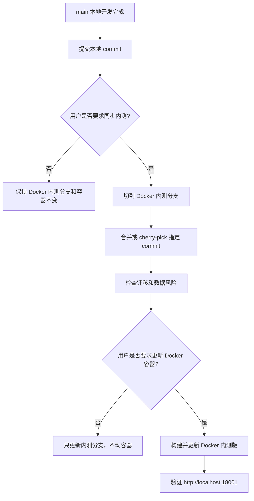

# 分支与数据管理约定

最后更新时间：2026-05-15  
当前状态：正式约定，必须遵守

## 1. 分支定位

本项目后续按以下本地分支策略管理：

| 分支 | 定位 | 说明 |
|---|---|---|
| `main` | 本地开发主分支 | 日常继续完善功能、修复问题、调试开发版本 |
| `codex/docker-internal-test-18001` | Docker 内测版本分支 | 记录当前部署到本地 Docker / OrbStack `18001` 的内测代码基线 |

说明：

1. `main` 是后续默认开发分支。
2. `codex/docker-internal-test-18001` 是 Docker 内测版本记录分支，不作为日常开发分支。
3. 没有用户明确要求时，不把 `main` 的新开发内容同步到 Docker 内测分支。
4. 没有用户明确要求时，不根据任何分支更新 Docker 内测容器。

## 2. 本地开发版与 Docker 内测版关系

| 环境 | 对应分支 | 数据来源 | 说明 |
|---|---|---|---|
| 本地开发版 | `main` | 本地开发 PostgreSQL / Redis | 用于日常开发和调试 |
| Docker 内测版 | `codex/docker-internal-test-18001` | Docker Compose 内部 PostgreSQL / Redis 卷 | 用于本地内测和验收 |

本地开发版和 Docker 内测版必须分开理解：

1. 本地开发版不是 Docker 内测版。
2. Docker 内测版不是开发沙盒。
3. Docker 内测版的数据不应被开发调试随意覆盖。
4. 二期 AI 修复中的“本地项目”默认指 `main` 对应的源码开发目录，不是 Docker 内测版。

## 3. 数据管理约定

### 3.1 本地开发数据

当前本地开发环境约定：

| 项目 | 值 |
|---|---|
| PostgreSQL 数据库 | `bug_feedback_system_dev` |
| PostgreSQL 连接 | `127.0.0.1:5432` |
| Redis | `localhost:6379/6` |
| Redis Key Prefix | `bug-feedback-system:` |

用途：

1. 日常开发调试。
2. 本地接口验证。
3. 功能修改后的快速测试。

### 3.2 Docker 内测数据

Docker 内测环境约定：

| 项目 | 值 |
|---|---|
| 访问地址 | `http://localhost:18001` |
| Compose 项目名 | `bug-feedback-18001` |
| PostgreSQL 数据库 | `rbac_admin_pro` |
| PostgreSQL 存储 | Docker volume `bug-feedback-18001_postgres_data` |
| Redis 存储 | Docker volume `bug-feedback-18001_redis_data` |
| 覆盖配置 | `docker-compose.orbstack-18001.yml` |

约束：

1. 未经用户明确允许，不清理 Docker volume。
2. 未经用户明确允许，不进入 Docker 数据库修改内测数据。
3. 涉及数据库结构更新时，应优先使用 Prisma migration，而不是手工改表。
4. 涉及破坏性迁移或数据清理时，必须先确认备份方案。

## 4. 从 main 同步到 Docker 内测分支的流程

只有当用户明确要求“同步到内测分支”“更新 Docker 内测版”“把当前版本部署到 Docker”等时，才执行以下流程：

## 5. 禁止事项

没有用户明确允许时，禁止：

1. 推送远程仓库。
2. 删除或重置本地分支。
3. 强制覆盖 Docker 内测分支。
4. 将 `main` 自动合并到 Docker 内测分支。
5. 重建、重启、停止 Docker 内测容器。
6. 清理 Docker 内测数据卷。
7. 将开发数据库数据直接覆盖到 Docker 内测数据库。

## 6. 推荐提交习惯

1. 本地开发每完成一个稳定功能点后提交到 `main`。
2. Docker 内测分支只记录经过确认的内测版本。
3. 同步内测分支前应说明本次同步包含哪些功能和风险。
4. 涉及数据结构变化时，同步说明中必须列出 migration 和数据初始化影响。
5. 如需更新 Docker 内测版，必须单独确认是否需要备份内测数据。

## 7. 当前执行约定

本次建立本地版本管理后：

1. 当前代码基线先提交到 `main`。
2. 从该提交创建 `codex/docker-internal-test-18001` 分支，作为当前 Docker 内测版基线。
3. 创建后切回 `main`，后续继续完善本地开发版本。
4. 后续只有用户明确要求时，才同步 `main` 到 Docker 内测分支或更新 Docker 内测容器。
