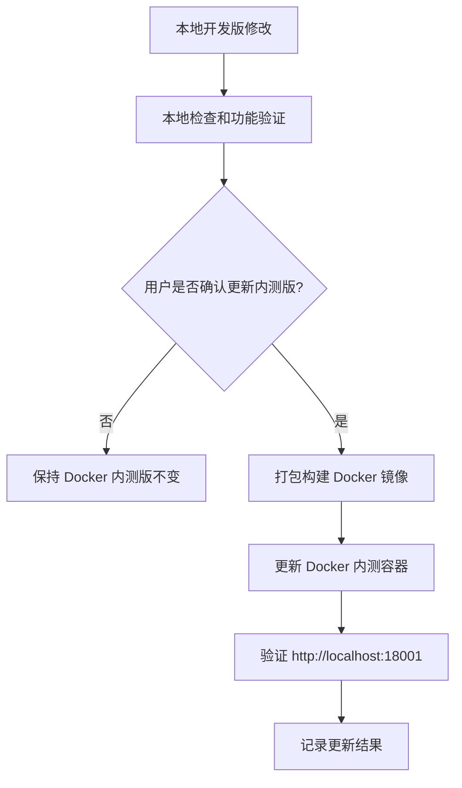

# 环境与发布边界

最后更新时间：2026-05-15  
当前状态：正式约定，必须遵守

## 1. 环境定义

本项目后续按两个环境协作：

| 环境 | 定位 | 说明 |
|---|---|---|
| 本地开发版 | 日常开发与功能完善 | 指直接在源码目录运行的开发版本，用于继续开发、调试、修复问题 |
| Docker 内测版 | 本地内测与验收 | 指已经打包部署到本地 OrbStack / Docker 的版本，用于相对稳定的内测体验 |

## 2. 当前项目路径与内测地址

| 项目 | 值 |
|---|---|
| 项目源码路径 | `/Volumes/data/fzl/pro/bug-feedback-system` |
| Docker 内测访问地址 | `http://localhost:18001` |
| Docker Compose 项目名 | `bug-feedback-18001` |
| Docker 覆盖配置 | `docker-compose.orbstack-18001.yml` |

## 3. 核心操作边界

### 3.1 本地开发版

默认后续功能开发、Bug 修复和调试都在本地开发版进行。

允许在用户确认范围内执行：

1. 修改源码。
2. 修改文档。
3. 调整数据库迁移或初始化脚本。
4. 运行开发环境所需的检查命令。
5. 使用本地开发数据库和 Redis 进行调试。

如涉及安装依赖、构建、打包、编译、发布等命令，仍需用户明确允许。

### 3.2 Docker 内测版

Docker 内测版视为相对稳定的验收环境。

没有用户明确允许时，禁止执行：

1. 重新构建 Docker 镜像。
2. 重启 Docker 内测容器。
3. 修改 Docker Compose 内测配置。
4. 清理 Docker 数据卷。
5. 进入 Docker 数据库修改内测数据。
6. 执行 `docker compose up/down/restart/build/pull` 等会影响内测环境的命令。
7. 用开发中的未确认代码覆盖 Docker 内测版。

只有当用户明确说“更新 Docker 版本”“部署到 Docker”“重新打包内测版”“启动/重启内测 Docker”等类似指令时，才允许操作 Docker 内测版。

## 4. 推荐发布流程

## 5. 发布前检查清单

更新 Docker 内测版前，应确认：

1. 用户已明确允许更新 Docker 内测版。
2. 本地开发版功能已验证。
3. 本次变更范围已说明。
4. 数据库迁移风险已评估。
5. 是否需要备份 Docker 内测数据已确认。
6. 更新后需要验证首页、登录、Bug 提交、附件上传、Bug 列表等关键流程。

## 6. 防误操作规则

1. 默认只改本地开发版，不碰 Docker 内测版。
2. Docker 内测版不是开发沙盒，不能随手重建或重启。
3. 任何影响 `http://localhost:18001` 的操作都必须先获得用户明确授权。
4. 如果只是继续完善现有版本，应优先在本地开发版验证。
5. 如果用户没有明确说更新 Docker，最终回复中只能建议更新，不能直接执行。

## 7. 与 AI 修复二期的关系

二期 AI 修复中的“本地项目”默认指本地开发版源码目录，不是 Docker 内测版。

AI Runner 只能对管理员配置的本地源码路径执行分析或修复。Docker 内测版仍然遵守本文件的发布边界：没有用户明确允许，不得自动更新。
