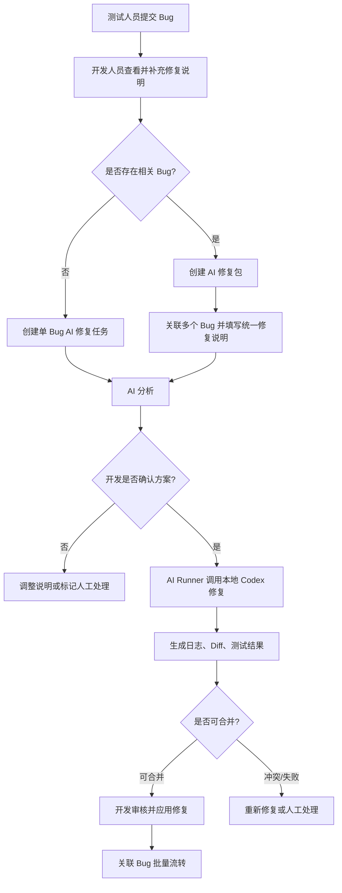

# 二期 AI 修复功能规划

最后更新时间：2026-05-15  
当前状态：二期规划，第一期不实现  
前置文档：

- [需求分析.md](./需求分析.md)
- [角色权限设计.md](./角色权限设计.md)
- [业务流程图.md](../架构文档/业务流程图.md)
- [AI修复架构设计.md](../架构文档/AI修复架构设计.md)

## 1. 背景与目标

本系统一期优先完善内部 Bug 提交、附件标注、流程流转、角色权限、统计看板和工作台体验，不接入 AI 自动修复能力。

二期计划在现有 Bug 管理闭环基础上扩展 AI 修复能力：开发人员在 Bug 详情或修复包页面补充修复说明后，可以由本机 AI Runner 调用本地 Codex，对本地对应项目进行分析、修复、测试和结果回传。

目标不是让 AI 绕过开发人员直接上线，而是提供一个可审查、可回滚、可控的辅助修复流程。

## 2. 一期与二期边界

| 阶段 | 范围 | 说明 |
|---|---|---|
| 一期 | Bug 提交、附件标注、状态流转、评论、快捷操作、角色工作台、基础统计 | 不实现 AI 修复，不接入本地 Codex，不新增 AI Runner |
| 二期 | AI 分析、AI 修复、AI 修复包、本地项目绑定、Runner 执行、Diff 审核、冲突检测 | 在一期流程稳定后独立迭代 |

一期中如需预留入口，最多只保留产品层面的规划说明，不在页面中暴露不可用按钮，避免用户误解。

## 3. 二期核心能力

### 3.1 AI 分析

开发人员可以基于 Bug 或修复包发起 AI 分析。AI 分析只读取项目代码和文档，不修改文件。

输出内容包括：

1. 可能的根因。
2. 预计影响文件。
3. 建议修复方案。
4. 风险点。
5. 建议验证命令。

### 3.2 AI 修复

开发人员确认修复说明后，系统创建 AI 修复任务，由本机 AI Runner 调用 Codex 执行修复。

修复任务应输出：

1. 执行日志。
2. 修改文件列表。
3. Diff 摘要。
4. 测试或检查结果。
5. 失败原因或人工处理建议。

### 3.3 AI 修复包

当多个 Bug 属于同一模块、同一文件或同一用户流程时，开发人员可以创建“AI 修复包”，将多个 Bug 合并为一次 AI 修复任务。

适合合并的情况：

1. 多个 Bug 属于同一项目、同一模块。
2. 多个 Bug 预计涉及同一文件或同一组件。
3. 多个 Bug 是同一个用户流程中的连续问题。
4. 分开修复容易互相覆盖或产生冲突。

不适合合并的情况：

1. 业务目标相互矛盾。
2. 风险等级不同，一个需要紧急修复，一个是普通优化。
3. 一个涉及安全/权限，一个只是 UI 样式。
4. 一个需要数据库或接口变更，另一个只改前端展示。

## 4. 推荐业务流程

## 5. 角色与权限建议

| 权限标识 | 权限名称 | 建议角色 | 说明 |
|---|---|---|---|
| ai:repo:list | 查看 AI 项目配置 | 超级管理员、项目负责人、开发人员 | 用于选择本地项目 |
| ai:repo:manage | 管理 AI 项目配置 | 超级管理员 | 配置本地项目路径和命令策略 |
| ai:task:analyze | 发起 AI 分析 | 开发人员、项目负责人 | 只读分析，不改代码 |
| ai:task:fix | 发起 AI 修复 | 开发人员、项目负责人 | 创建可写修复任务 |
| ai:task:view | 查看 AI 任务 | 开发人员、项目负责人、测试人员可选 | 查看日志和结果 |
| ai:task:cancel | 取消 AI 任务 | 创建人、项目负责人、超级管理员 | 终止待执行或执行中任务 |
| ai:task:apply | 应用 AI 修复 | 开发人员、项目负责人 | 将修复结果应用到真实项目 |
| ai:package:manage | 管理 AI 修复包 | 开发人员、项目负责人 | 合并多个相关 Bug |

权限原则：

1. 测试人员默认不直接发起 AI 修复。
2. 开发人员必须补充清晰修复说明后才能发起。
3. 超级管理员负责配置本地项目路径、命令白名单和 Runner 凭证。
4. AI 不能自动提交、推送或部署，除非后续单独增加受控策略。

## 6. 配置化要求

二期不得将项目路径、命令、角色工作台、AI 策略硬编码在代码中。建议配置化管理：

1. 本地项目路径配置。
2. Bug 项目与本地代码仓库映射。
3. 允许执行的检查命令。
4. 禁止执行的危险命令。
5. Runner 心跳和授权 token。
6. 是否允许安装依赖、构建、测试、提交、推送。
7. 单任务超时时间。

## 7. 数据对象草案

二期建议新增以下核心对象：

1. AI Runner：本机执行器。
2. AI 项目仓库配置：Bug 项目与本地代码目录映射。
3. AI 修复任务：单次分析或修复执行记录。
4. AI 修复包：多个 Bug 的合并修复上下文。
5. AI 修复包关联 Bug：修复包与 Bug 的多对多关系。
6. AI 命令策略：允许和禁止执行的命令配置。
7. AI 任务日志：任务输出和关键事件记录。

详细表结构在 [AI修复架构设计.md](../架构文档/AI修复架构设计.md) 中细化。

## 8. 页面规划

### 8.1 Bug 详情页新增 AI 修复 Tab

二期可在 Bug 详情页增加：

1. AI 分析。
2. AI 修复。
3. 修复说明。
4. 关联本地项目。
5. 任务日志。
6. 修改文件和 Diff。
7. 应用修复、重新修复、标记人工处理。

### 8.2 AI 修复包页面

用于多个相关 Bug 合并修复，建议包含：

1. 修复包标题。
2. 关联 Bug 列表。
3. 目标项目和模块。
4. 统一修复说明。
5. 统一验收标准。
6. AI 分析结果。
7. AI 修复任务列表。
8. Diff 审核和冲突检测结果。

### 8.3 系统配置页面

建议新增：

1. AI Runner 管理。
2. AI 项目仓库配置。
3. AI 命令策略配置。
4. AI 执行日志审计。

## 9. 验收标准草案

二期完成后至少满足：

1. 管理员可以配置 Bug 项目与本地项目路径映射。
2. 本机 AI Runner 可以注册、心跳、领取任务和回传结果。
3. 开发人员可以对单个 Bug 发起 AI 分析。
4. 开发人员可以对单个 Bug 发起 AI 修复。
5. 开发人员可以创建 AI 修复包并关联多个 Bug。
6. AI 修复必须在隔离工作区执行，不直接覆盖主工作区。
7. 系统可以展示 AI 修复日志、修改文件和 Diff。
8. 应用修复前必须进行冲突检测。
9. 冲突任务不能自动应用，必须提示人工处理或重新修复。
10. 默认不允许 AI 自动 git commit、git push、部署或删除用户数据。

## 10. 风险与控制措施

| 风险 | 说明 | 控制措施 |
|---|---|---|
| AI 误改代码 | 修复理解错误或修改范围过大 | 分析和修复分阶段，Diff 审核后再应用 |
| 多任务冲突 | 多个 Bug 修改同一文件 | 独立工作区、修复包、合并队列和冲突检测 |
| 本机命令风险 | AI 可能执行危险命令 | 命令白名单、黑名单、超时、Runner 权限隔离 |
| 路径越权 | 用户输入任意本地路径 | 只能选择管理员配置的项目路径 |
| 结果不可追踪 | 无法复盘 AI 做了什么 | 保存日志、Prompt、Diff、执行命令和结果 |
| 影响一期稳定性 | AI 功能引入复杂度 | 明确放到二期，一期不实现、不暴露入口 |

## 11. 二期任务拆分建议

| 阶段 | 任务 | 说明 |
|---|---|---|
| 2.1 | AI 配置基础表 | Runner、项目仓库、命令策略 |
| 2.2 | AI Runner MVP | 本机 Node 服务，领取任务并调用 Codex |
| 2.3 | 单 Bug AI 分析 | 只读分析，不改代码 |
| 2.4 | 单 Bug AI 修复 | 隔离工作区修复，回传日志和 Diff |
| 2.5 | AI 修复包 | 多 Bug 合并修复 |
| 2.6 | 冲突检测与应用 | patch 检查、人工确认、应用修复 |
| 2.7 | 审计与安全强化 | 日志、命令策略、超时、失败恢复 |

## 12. 当前结论

AI 修复功能作为二期规划保留，当前一期继续聚焦现有 Bug 管理能力完善。

一期不做：

1. 不接入 Codex。
2. 不开发 AI Runner。
3. 不新增 AI 修复按钮。
4. 不做代码自动修复。
5. 不做 AI 修复包。

二期启动前需要重新评审本规划，并确认本地项目路径、执行安全策略和 Runner 部署方式。
