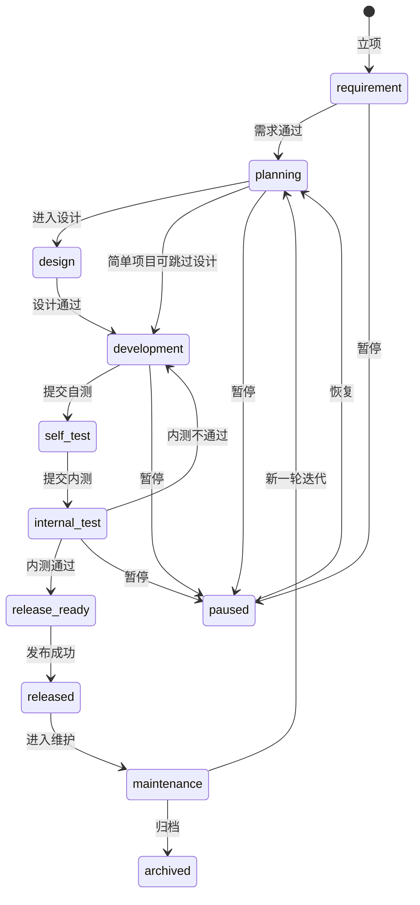
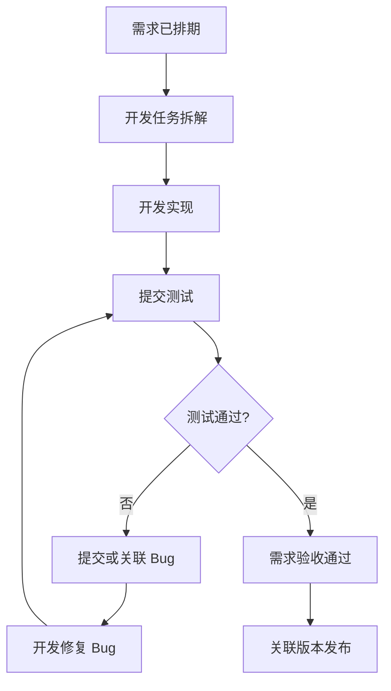

# 项目管理功能规划

最后更新时间：2026-05-15  
当前状态：规划已进入基础版实现；数据模型、接口、权限菜单草案和前端基础页面已完成代码落地，待迁移、seed 和类型检查后验收

## 目录

- [1. 背景与目标](#1-背景与目标)
- [2. 同类产品参考总结](#2-同类产品参考总结)
- [3. 建议建设原则](#3-建议建设原则)
- [4. 功能范围建议](#4-功能范围建议)
- [5. 项目阶段设计](#5-项目阶段设计)
- [6. 需求管理设计](#6-需求管理设计)
- [7. 迭代与里程碑设计](#7-迭代与里程碑设计)
- [8. 任务管理建议](#8-任务管理建议)
- [9. 与现有 Bug 功能的关联](#9-与现有-bug-功能的关联)
- [10. 推荐页面规划](#10-推荐页面规划)
- [11. 管理层实时项目进度看板](#11-老板管理层实时项目进度看板)
- [12. 数据模型建议](#12-数据模型建议)
- [13. 权限设计建议](#13-权限设计建议)
- [14. 进度计算建议](#14-进度计算建议)
- [15. 开发实现拆分建议](#15-开发实现拆分建议)
- [16. 建议接口清单](#16-建议接口清单)
- [17. 验收标准建议](#17-验收标准建议)
- [18. 风险与注意事项](#18-风险与注意事项)
- [19. 推荐落地顺序](#19-推荐落地顺序)
- [20. 待确认问题](#20-待确认问题)

## 1. 背景与目标

当前系统已经具备 Bug 反馈、项目配置、项目模块、项目版本、项目成员、Bug 状态流转、附件、评论和基础统计能力。下一阶段建议在现有 Bug 闭环基础上补充“项目管理”能力，让系统不仅能跟踪 Bug，也能管理：

1. 项目的开发进度。
2. 下一阶段项目安排。
3. 需求池、需求评审、需求排期和需求验收。
4. 项目当前所处阶段，例如需求阶段、开发阶段、内测阶段、发布阶段。
5. 需求、任务、Bug、版本和迭代之间的关联关系。
6. 项目负责人、产品、开发、测试之间的协同看板和进度看板。

建议系统定位从“内部 Bug 反馈系统”逐步升级为：

> 面向内部团队的轻量级研发项目协作平台，以 Bug 闭环为基础，补充需求、迭代、里程碑、项目阶段和进度度量，避免一开始做成过重的 Jira/禅道替代品。

## 2. 同类产品参考总结

| 产品 | 可借鉴能力 | 对本项目的启发 |
|---|---|---|
| Jira Software | Timeline/Roadmap 用于长期项目计划，支持父子工作项、进度条、负责人、Scrum Sprint、Release 和依赖关系。 | 本项目可先做“项目路线图 + 里程碑 + 阶段进度”，不必第一版实现复杂依赖网络。 |
| GitHub Projects | 同一批工作项支持 Table、Board、Roadmap 多视图；支持自定义字段、过滤、排序、分组、迭代字段和里程碑。 | 本项目应采用“同一数据，多种视图”的设计：列表、看板、路线图共享同一套需求/任务/Bug 数据。 |
| Linear | Project 是有明确起止时间的交付目标；Milestone 表示项目生命周期阶段；Cycle 类似 Sprint，用于固定周期内优先处理的一批事项。 | 适合借鉴“项目阶段/里程碑”概念，例如需求确认、开发、内测、公测、发布；同时保留迭代作为短周期交付单位。 |
| Azure DevOps Boards | Delivery Plans 可跨团队/Backlog 查看多个迭代中的计划工作，支持汇总进度、调整日期和依赖查看。 | 后续可做多项目/多迭代概览；第一版先做单项目内的迭代计划和进度汇总。 |
| GitLab | Milestone 用于按目标组织 Issue/Epic/MR；Issue Board 可按标签、里程碑、迭代、负责人、状态创建可拖拽列表，并支持 WIP 限制。 | 本项目可做按“状态/负责人/迭代/需求”的看板视图；WIP 限制可作为二期优化。 |
| 禅道 | 典型流程为产品/项目/执行/需求/任务/Bug/用例/版本/发布；执行看板可综合查看需求、Bug、任务状态和进度。 | 对国内研发团队理解成本低，可借鉴“需求 → 任务 → Bug/测试 → 版本 → 发布”的闭环，但需简化以贴合当前系统。 |

参考资料：

- [Jira 时间线/Roadmap 官方说明](https://support.atlassian.com/jira-software-cloud/docs/what-is-the-roadmap/)
- [GitHub Projects 官方说明](https://docs.github.com/en/issues/planning-and-tracking-with-projects/learning-about-projects/about-projects)
- [GitHub Projects 视图布局官方说明](https://docs.github.com/en/issues/planning-and-tracking-with-projects/customizing-views-in-your-project)
- [Linear Projects 官方说明](https://linear.app/docs/projects)
- [Linear Project milestones 官方说明](https://linear.app/docs/project-milestones)
- [Azure DevOps Delivery Plans 官方说明](https://learn.microsoft.com/en-us/azure/devops/boards/plans/review-team-plans)
- [GitLab Milestones 官方说明](https://docs.gitlab.com/ee/user/project/milestones/)
- [GitLab Issue boards 官方说明](https://docs.gitlab.com/ee/user/project/issue_board.html)
- [禅道执行看板官方说明](https://www.zentao.net/book/zentaopms/894.mhtml)
- [禅道新版本最简使用流程](https://www.zentao.net/book/zentaopms/1702.html)

## 3. 建议建设原则

### 3.1 轻量优先

第一版不要完整复刻 Jira、Azure DevOps 或禅道，而是在当前 Bug 系统基础上补齐最关键的项目管理闭环：

```text
项目 → 需求 → 迭代/里程碑 → 任务/Bug → 验收 → 版本/发布
```

### 3.2 同一数据，多种视图

需求、任务、Bug、迭代、里程碑应该共享同一套基础数据关联，前端提供不同视图：

1. 表格视图：适合批量筛选和维护。
2. 看板视图：适合每日推进和状态流转。
3. 路线图视图：适合查看项目阶段、里程碑和时间安排。
4. 统计视图：适合负责人查看风险和整体进度。

### 3.3 配置驱动优先

项目阶段、需求状态、任务状态、迭代状态、优先级、难度、风险等级等，应优先使用字典或集中配置维护，避免散落在页面和接口里的硬编码。

建议后端集中维护类似：

```text
projectStageWorkflow
requirementWorkflow
iterationWorkflow
taskWorkflow
progressWeightConfig
```

前端只根据接口或共享配置渲染状态标签、按钮和可选操作。

### 3.4 渐进式扩展，避免大重构

当前已有 `BugProject`、`BugProjectModule`、`BugProjectVersion`、`BugProjectMember`、`BugTicket` 等模型。建议第一版采用“新增项目管理表 + 关联现有 Bug 表”的方式，不建议立刻重构为统一 WorkItem 大表。

## 4. 功能范围建议

### 4.1 第一版必须做

| 模块 | 功能 | 说明 |
|---|---|---|
| 项目概览 | 项目基础信息、当前阶段、负责人、成员、时间、进度 | 在现有项目管理基础上扩展项目阶段和进度字段。 |
| 项目阶段 | 维护项目当前阶段 | 支持需求、规划、设计、开发、内测、发布、维护等阶段。 |
| 需求管理 | 需求创建、评审、排期、状态流转 | 支持需求池、优先级、验收标准、关联项目/模块/迭代。 |
| 迭代管理 | 迭代计划、开始/结束、目标、范围 | 用于管理一段周期内要完成的需求、任务和 Bug。 |
| 里程碑管理 | 阶段性目标和目标日期 | 适合管理“开发完成、内测开始、发布上线”等节点。 |
| 进度统计 | 按项目、迭代、需求、Bug 统计进度 | 优先做数量和状态统计，后续再做工时/燃尽图。 |
| 项目仪表盘 | 管理层实时查看项目进度、风险、延期和下阶段安排 | 用只读高层摘要降低沟通成本，让老板能放心安排工程进度。 |
| 项目看板 | 按状态拖动需求/任务/Bug | 第一版可以先支持需求和 Bug，不强制支持复杂任务。 |
| 关联关系 | 需求关联 Bug、版本、迭代、里程碑 | 便于从需求追踪到缺陷和发布。 |

### 4.2 第一版建议暂缓

| 能力 | 暂缓原因 | 后续建议 |
|---|---|---|
| 跨项目组合管理 | 实现复杂度高，当前项目规模未必需要 | 二期做项目组合/项目集视图。 |
| 甘特图依赖网络 | 依赖关系、拖拽排期和冲突检测较复杂 | 先用简单路线图，后续再加依赖。 |
| 工时日报/成本管理 | 会显著增加录入成本 | 如团队确实需要，再做轻量工时。 |
| WIP 限制 | 第一版看板可以先不限制 | 二期用于限制“修复中/测试中”堆积。 |
| 自动排期 | 需要容量、估算、优先级模型 | 后续结合 AI 或规则做建议排期。 |
| 外部客户需求门户 | 当前系统定位内部使用 | 等内部流程稳定后再考虑。 |

## 5. 项目阶段设计

建议项目阶段使用独立字段 `projectStage`，与项目启用/停用状态分开。

| 阶段值 | 显示名 | 含义 | 典型进入条件 | 典型退出条件 |
|---|---|---|---|---|
| requirement | 需求阶段 | 正在收集、澄清和评审需求 | 立项或需求池初始化 | 核心需求已确认 |
| planning | 规划阶段 | 正在做范围、排期、人员和版本规划 | 需求通过评审 | 迭代和里程碑确定 |
| design | 设计阶段 | 正在做原型、交互、架构或数据库设计 | 规划完成 | 设计评审通过 |
| development | 开发阶段 | 开发正在实现需求和修复 Bug | 迭代启动 | 主要需求开发完成 |
| self_test | 自测阶段 | 开发自测和联调 | 开发提交自测 | 自测通过并提交测试 |
| internal_test | 内测阶段 | 测试或内部用户进行验证 | 测试版本可用 | 阻断问题修复完成 |
| release_ready | 待发布 | 已满足上线条件，等待发布窗口 | 内测通过 | 发布完成 |
| released | 已发布 | 版本已交付或上线 | 发布成功 | 进入维护或下一轮迭代 |
| maintenance | 维护阶段 | 已上线后的日常维护、缺陷修复和小需求 | 发布后稳定运行 | 项目归档或启动新规划 |
| paused | 已暂停 | 因资源、范围或外部原因暂停 | 负责人手动暂停 | 恢复规划/开发/测试 |
| archived | 已归档 | 项目结束，不再活跃维护 | 项目验收完成 | 原则上不再恢复 |

### 5.1 项目阶段流转建议



## 6. 需求管理设计

### 6.1 需求类型

| 类型 | 说明 |
|---|---|
| feature | 新功能 |
| improvement | 优化改进 |
| technical | 技术改造 |
| ux | 体验优化 |
| security | 安全需求 |
| data | 数据/报表需求 |
| operation | 运营配置需求 |

### 6.2 需求状态

| 状态值 | 显示名 | 含义 |
|---|---|---|
| draft | 草稿 | 刚创建，信息未完整 |
| submitted | 已提交 | 等待产品或项目负责人评审 |
| reviewing | 评审中 | 正在确认范围、价值和可行性 |
| approved | 已通过 | 需求有效，但未排期 |
| rejected | 已驳回 | 不纳入项目范围 |
| deferred | 已延期 | 有价值但暂不做 |
| planned | 已排期 | 已进入迭代或里程碑 |
| developing | 开发中 | 需求正在实现 |
| testing | 测试中 | 进入测试或内测验证 |
| accepted | 已验收 | 验收通过，等待发布或关闭 |
| released | 已发布 | 已随版本发布 |
| closed | 已关闭 | 需求生命周期结束 |
| changed | 变更中 | 范围发生变化，需要重新评审 |

### 6.3 需求核心字段

| 字段 | 是否必填 | 说明 |
|---|---|---|
| 需求标题 | 是 | 简洁描述需求目标 |
| 所属项目 | 是 | 关联 `BugProject` |
| 所属模块 | 否 | 关联 `BugProjectModule` |
| 需求类型 | 是 | 新功能、优化、技术、安全等 |
| 来源 | 否 | 内部、客户、运营、测试、老板、数据分析等 |
| 优先级 | 是 | urgent/high/medium/low |
| 业务价值 | 否 | 高/中/低或数字评分 |
| 实现难度 | 否 | 高/中/低或故事点 |
| 状态 | 是 | 使用需求状态流转 |
| 负责人 | 否 | 产品或需求负责人 |
| 开发负责人 | 否 | 进入开发后填写 |
| 测试负责人 | 否 | 进入测试后填写 |
| 计划开始时间 | 否 | 排期参考 |
| 计划完成时间 | 否 | 排期参考 |
| 实际完成时间 | 否 | 验收或发布时记录 |
| 需求描述 | 是 | 背景、目标、范围 |
| 验收标准 | 是 | 可验证的完成条件 |
| 备注 | 否 | 其他说明 |

### 6.4 需求评审建议

需求通过评审至少需要确认：

1. 需求价值是否明确。
2. 是否属于当前项目范围。
3. 是否有清晰的验收标准。
4. 是否能拆分到一个迭代内交付。
5. 是否存在依赖项或阻塞项。
6. 是否需要关联已有 Bug、版本或历史需求。

## 7. 迭代与里程碑设计

### 7.1 迭代管理

迭代用于管理短周期交付，建议用于 1～4 周的开发/测试周期。

| 字段 | 说明 |
|---|---|
| 迭代名称 | 例如 `2026-05 内测迭代` |
| 所属项目 | 关联项目 |
| 迭代目标 | 本轮最重要的交付目标 |
| 开始时间 | 计划开始日期 |
| 结束时间 | 计划结束日期 |
| 状态 | 未开始、进行中、测试中、已完成、已取消 |
| 负责人 | 迭代负责人 |
| 范围说明 | 本轮包含哪些需求、任务、Bug |
| 风险说明 | 可能延期或阻塞的事项 |

建议迭代状态：

```text
planned → active → testing → completed
```

异常状态：

```text
cancelled / paused
```

### 7.2 里程碑管理

里程碑用于管理项目生命周期中的关键节点，建议用于跨迭代或阶段性目标。

| 字段 | 说明 |
|---|---|
| 里程碑名称 | 例如“开发完成”“内测开始”“V1.0 发布” |
| 所属项目 | 关联项目 |
| 目标日期 | 计划达成日期 |
| 当前状态 | 未开始、进行中、已达成、已延期、已取消 |
| 阶段类型 | 需求、设计、开发、内测、发布、维护等 |
| 负责人 | 里程碑负责人 |
| 完成条件 | 达成标准 |
| 关联需求 | 该里程碑下的需求范围 |
| 关联 Bug | 阻断或必须修复的 Bug |

### 7.3 迭代与里程碑的区别

| 对比项 | 迭代 | 里程碑 |
|---|---|---|
| 核心含义 | 一段固定周期内要完成的工作 | 项目生命周期中的关键节点 |
| 时间跨度 | 通常 1～4 周 | 可跨多个迭代 |
| 关注点 | 本轮做什么、谁负责、完成多少 | 是否达到阶段目标，例如内测或发布 |
| 适合视图 | 迭代看板、燃尽图、列表 | 路线图、项目概览、阶段报告 |

## 8. 任务管理建议

任务可以作为需求的实现拆解，也可以作为 Bug 修复的执行项。考虑到当前系统已有 BugTicket，第一版建议任务管理保持轻量。

### 8.1 第一版任务范围

1. 支持从需求下创建任务。
2. 支持任务标题、负责人、状态、优先级、预计完成时间。
3. 支持任务关联需求、迭代、项目模块。
4. 支持在项目看板中查看任务。
5. 支持任务完成后推动需求进度。

### 8.2 任务状态

```text
todo → in_progress → done
```

异常状态：

```text
blocked / cancelled
```

第一版不强制做详细工时，最多保留 `estimateHours` 和 `actualHours` 字段，后续按团队习惯决定是否启用。

## 9. 与现有 Bug 功能的关联

### 9.1 Bug 需要补充的关联字段

建议后续为 `BugTicket` 增加以下可选关联：

| 字段 | 说明 |
|---|---|
| requirementId | 关联需求，用于说明该 Bug 属于哪个需求验收问题 |
| iterationId | 关联迭代，用于统计本轮待修复 Bug |
| milestoneId | 关联里程碑，用于识别阻断发布/内测的 Bug |
| taskId | 可选，关联修复任务 |

### 9.2 Bug 对项目进度的影响

建议定义阻断规则：

1. 严重程度为 `fatal` 或 `serious` 且状态未关闭的 Bug，会阻断里程碑达成。
2. 关联某需求的阻断 Bug 未关闭时，该需求不能进入 `accepted` 或 `released`。
3. 迭代结束时仍有未关闭高优先级 Bug，应在迭代总结中标记风险。

### 9.3 需求验收与 Bug 闭环



## 10. 推荐页面规划

### 10.1 菜单结构

建议新增一级菜单：`项目管理`。

```text
项目管理
├── 项目仪表盘
├── 项目概览
├── 需求管理
├── 迭代计划
├── 里程碑
├── 项目看板
├── 项目配置
├── 模块管理
├── 版本管理
├── Bug 看板
├── 我的任务（后续）
├── 项目统计（后续）
└── 管理层周报（后续）
```

现有 Bug 系统里的项目、模块、版本、Bug 看板属于项目进度管理的基础支撑菜单，统一迁入一级菜单 `项目管理` 下；`Bug 管理` 仅保留 Bug 列表、我的 Bug、提交 Bug 等工单处理入口。

```text
项目配置
├── 项目基础信息
├── 项目成员
├── 模块管理
└── 版本管理
```

### 10.2 项目仪表盘页

页面目标：让老板或管理层不需要进入每个需求和 Bug 详情，也能实时判断“项目是否按计划推进、哪里有风险、下一阶段怎么安排、是否需要加人或调整排期”。

设计原则：

1. 只读为主，避免管理层误操作业务数据。
2. 默认展示全局项目概况，支持按项目、负责人、阶段、风险等级筛选。
3. 用红黄绿灯表达风险，但必须同时提供文字说明，不能只依赖颜色。
4. 指标必须可追溯，点击项目卡片可以下钻到项目概览、里程碑、需求或阻断 Bug。
5. 自动刷新建议默认 1～5 分钟，可手动刷新；避免给人“数据过期”的感觉。

建议模块：

1. 总览指标：项目总数、正常推进、存在风险、已延期、即将发布。
2. 关键进度：平均项目进度、需求完成率、Bug 关闭率、内测通过率。
3. 项目健康度列表：项目、负责人、当前阶段、计划完成日、进度、风险等级、延期天数、下一动作。
4. 当前处理事项：当前开发正在处理的需求、正在修复的 Bug 数量和明细入口。
5. 历史完成事项：指定时间范围内已完成需求、已修复 Bug 数量和明细入口。
6. 未处理事项：未处理需求、未处理 Bug 数量、优先级分布和最长停留时间。
7. 风险雷达：阻断 Bug、延期需求、人员负载异常、里程碑临近未完成。
8. 下阶段安排：未来 7/14/30 天将进入开发、内测、发布的项目。
9. 里程碑时间线：按日期展示关键节点，例如开发完成、内测开始、上线发布。
10. 管理层行动建议：系统根据风险规则给出“需要老板关注/协调”的事项。

### 10.3 项目概览页

页面目标：让项目负责人一眼看到当前阶段、进度、风险和下一步安排。

建议模块：

1. 项目基础信息卡片。
2. 当前项目阶段和阶段流转操作。
3. 总进度、需求完成率、Bug 关闭率、延期项数量。
4. 当前迭代摘要。
5. 下一个里程碑。
6. 高风险需求和阻断 Bug。
7. 最近操作动态。

### 10.4 需求管理页

建议支持：

1. 需求列表。
2. 新增/编辑需求。
3. 需求评审操作。
4. 状态流转。
5. 关联迭代、里程碑、版本。
6. 关联 Bug。
7. 需求详情页：描述、验收标准、任务、Bug、评论、历史。

### 10.5 迭代计划页

建议支持：

1. 迭代列表。
2. 迭代详情。
3. 本轮需求范围。
4. 本轮 Bug 范围。
5. 负责人和日期。
6. 迭代状态流转。
7. 迭代进度统计。

### 10.6 项目看板页

第一版建议提供三种看板切换：

| 看板 | 列 | 卡片 |
|---|---|---|
| 需求看板 | 草稿、评审中、已通过、已排期、开发中、测试中、已验收 | 需求 |
| Bug 看板 | 待确认、已确认、已分配、修复中、待验证、已关闭 | Bug |
| 迭代看板 | 待处理、进行中、测试中、已完成 | 需求 + 任务 + Bug |

拖拽调整状态可以作为二期；第一版可先用详情侧栏操作状态，降低风险。

### 10.7 路线图/里程碑页

第一版可以先做轻量时间线，不必完整甘特图。

建议展示：

1. 项目阶段条。
2. 里程碑节点。
3. 迭代时间段。
4. 关键版本发布时间。
5. 每个节点的完成百分比和风险状态。


## 11. 管理层实时项目进度看板

该看板建议命名为“项目仪表盘”或“项目仪表盘”，与项目负责人使用的“项目概览”区分开。项目负责人需要细节和操作入口，老板更需要可信、实时、可解释的高层摘要。

### 11.1 看板目标

老板打开看板后，应在 30 秒内回答以下问题：

1. 当前有多少项目在推进？
2. 哪些项目正常，哪些项目有风险或已经延期？
3. 每个项目现在处于需求、开发、内测、发布中的哪个阶段？
4. 关键里程碑是否能按期完成？
5. 下阶段有哪些项目要进入开发、内测或发布？
6. 是否需要协调资源，例如加人、调整范围、延后发布日期？
7. 哪些阻断 Bug 或高优需求正在影响工程进度？

### 11.2 看板信息架构

```text
项目仪表盘
├── 顶部全局筛选
│   ├── 时间范围：本周 / 本月 / 本季度 / 自定义
│   ├── 项目阶段：需求 / 开发 / 内测 / 发布 / 维护
│   ├── 项目负责人
│   └── 风险等级：全部 / 正常 / 关注 / 高风险 / 已延期
├── 全局概览指标
├── 项目健康度排行
├── 关键里程碑时间线
├── 下阶段项目安排
├── 风险与阻塞事项
└── 管理层行动建议
```

### 11.3 核心指标

| 指标 | 含义 | 建议计算方式 | 管理价值 |
|---|---|---|---|
| 项目总数 | 当前可见项目数量 | 未归档且有权限查看的项目 | 了解工程盘子大小 |
| 正常推进项目数 | 无延期、无高风险阻塞的项目 | `riskLevel = low` 且未延期 | 让老板知道哪些项目不用操心 |
| 风险项目数 | 存在阻断 Bug、延期需求或里程碑风险的项目 | 风险规则聚合 | 提醒需要协调资源 |
| 已延期项目数 | 当前日期超过计划完成日仍未发布/关闭 | `now > plannedEndTime` 且未完成 | 暴露排期问题 |
| 平均项目进度 | 所有进行中项目的平均进度 | 项目进度求平均 | 判断整体推进速度 |
| 需求完成率 | 已验收/已发布需求占比 | `accepted/released/closed / all` | 判断范围完成情况 |
| Bug 关闭率 | 已关闭 Bug 占比 | `closed / all` | 判断质量收敛情况 |
| 阻断 Bug 数 | 严重/致命且未关闭 Bug 数 | `severity in fatal/serious and status != closed` | 判断是否影响内测/发布 |
| 当前处理中需求数 | 开发中/测试中或当前迭代未完成需求数 | 按需求状态配置统计 | 判断开发当前处理范围 |
| 当前修复中 Bug 数 | 已分配/修复中/待验证 Bug 数 | 按 Bug 工作流配置统计 | 判断缺陷修复压力 |
| 历史完成需求数 | 时间范围内完成的需求数 | `accepted/released/closed` 进入时间 | 判断历史交付产出 |
| 历史已修复 Bug 数 | 时间范围内关闭的 Bug 数 | `closed` 进入时间 | 判断历史修复产出 |
| 未处理需求数 | 已提交/已通过/已排期但未开始的需求数 | 按需求状态配置统计 | 判断需求积压 |
| 未处理 Bug 数 | 待确认/已确认且未进入修复的 Bug 数 | 按 Bug 工作流配置统计 | 判断缺陷积压 |
| 里程碑准时率 | 按期完成里程碑占比 | 按目标日期和完成时间计算 | 判断排期可信度 |
| 未来 7 天关键节点 | 7 天内到期或要进入下一阶段的项目 | 里程碑/迭代结束日期 | 方便老板提前安排人力 |

### 11.4 项目健康度

建议每个项目生成一个健康度状态，作为老板看板的核心展示字段。

| 健康度 | 显示 | 判定建议 | 处理建议 |
|---|---|---|---|
| healthy | 正常 | 进度不落后、无阻断 Bug、关键里程碑未延期 | 无需干预 |
| watch | 关注 | 进度轻微落后，或未来 7 天有关键节点但完成率偏低 | 项目负责人跟进即可 |
| risk | 高风险 | 有阻断 Bug、延期需求、人员负载异常或里程碑可能延期 | 需要管理层关注 |
| delayed | 已延期 | 已超过计划完成日或关键里程碑延期 | 需要调整排期或资源 |
| paused | 已暂停 | 项目阶段为暂停 | 需要明确恢复条件 |

健康度不要只靠人工维护，建议采用“系统规则计算 + 项目负责人手动修正说明”的方式。

### 11.5 风险规则建议

| 风险类型 | 触发条件 | 风险等级 | 看板提示 |
|---|---|---|---|
| 里程碑临近 | 里程碑 7 天内到期，完成率低于 80% | 关注 | “里程碑临近，完成率偏低” |
| 里程碑延期 | 当前日期超过目标日期且未完成 | 高风险/已延期 | “里程碑已延期 N 天” |
| 阻断 Bug | 存在 fatal/serious 且未关闭 Bug | 高风险 | “存在 N 个阻断 Bug” |
| 内测质量风险 | 内测阶段 Bug 关闭率低于 80% | 高风险 | “内测 Bug 未收敛” |
| 需求膨胀 | 迭代开始后新增需求超过阈值 | 关注/高风险 | “迭代范围持续扩大” |
| 无负责人 | 项目/需求/阻断 Bug 无负责人 | 高风险 | “关键事项无人负责” |
| 长时间无更新 | 项目超过 N 天无动态 | 关注 | “项目近期无更新” |
| 计划缺失 | 无计划完成日或无下一里程碑 | 关注 | “缺少明确交付节点” |

风险阈值建议配置化，例如 `riskConfig.milestoneDueDays = 7`、`riskConfig.minTestingBugCloseRate = 80`，避免写死。

### 11.6 下阶段项目安排

老板最关心的不只是当前进度，还包括接下来工程怎么排。建议看板提供“下阶段安排”区域：

| 时间窗口 | 展示内容 | 用途 |
|---|---|---|
| 未来 7 天 | 即将开始内测、即将发布、即将到期里程碑 | 短期协调 |
| 未来 14 天 | 即将进入开发/自测/内测的项目 | 人力安排 |
| 未来 30 天 | 预计发布、预计归档、下一轮规划项目 | 版本节奏和资源预判 |

每条安排建议展示：

1. 项目名称。
2. 当前阶段。
3. 下一阶段。
4. 计划切换日期。
5. 当前完成率。
6. 负责人。
7. 风险等级。
8. 需要老板协调的事项。

### 11.7 管理层行动建议

为了让老板不仅“看到数据”，还知道“要不要管”，建议生成行动建议：

| 建议类型 | 示例 | 触发来源 |
|---|---|---|
| 无需干预 | “A 项目按计划推进，预计 5 月 20 日进入内测。” | 健康度正常 |
| 关注跟进 | “B 项目 7 天后内测，但需求完成率仅 60%，建议项目负责人确认范围。” | 里程碑临近 + 完成率低 |
| 协调资源 | “C 项目存在 3 个阻断 Bug，均集中在支付模块，建议协调后端支持。” | 阻断 Bug 聚合 |
| 调整排期 | “D 项目已延期 4 天，当前仍处于开发阶段，建议重新确认发布日期。” | 项目延期 |
| 明确负责人 | “E 项目的内测里程碑未设置负责人。” | 负责人缺失 |

### 11.8 页面低保真结构

```text
┌────────────────────────────────────────────────────────────┐
│ 项目仪表盘                         自动刷新：1分钟前  [刷新] │
│ 时间：本月  阶段：全部  负责人：全部  风险：全部             │
├──────────┬──────────┬──────────┬──────────┬──────────┤
│ 进行中项目 │ 正常推进  │ 风险项目  │ 已延期   │ 7天关键节点 │
│ 12       │ 8        │ 3        │ 1        │ 5        │
├────────────────────────────────────────────────────────────┤
│ 项目健康度                                                   │
│ 项目        阶段     进度    负责人  计划完成   风险   下一动作 │
│ A项目       开发中   72%     张三    05-25     正常   05-18自测│
│ B项目       内测中   64%     李四    05-20     高风险 修复阻断Bug│
│ C项目       规划中   30%     王五    06-10     关注   确认范围   │
├────────────────────────────────────────────────────────────┤
│ 左：里程碑时间线                  右：风险与阻塞事项          │
├────────────────────────────────────────────────────────────┤
│ 下阶段安排：未来7天 / 14天 / 30天                            │
├────────────────────────────────────────────────────────────┤
│ 管理层行动建议                                                │
└────────────────────────────────────────────────────────────┘
```

### 11.9 权限与可见范围

建议增加“管理层/老板”角色或权限，不一定参与项目成员配置，但可查看授权范围内的项目摘要。

| 角色 | 可见范围 | 操作权限 |
|---|---|---|
| 管理层 | 全部项目或授权项目的进度摘要 | 默认只读，可查看详情下钻 |
| 项目负责人 | 负责项目的完整概览和操作 | 可维护阶段、风险、里程碑、迭代 |
| 普通成员 | 自己参与项目 | 只看与自己相关的需求、任务、Bug |

建议权限点：

| 权限点 | 说明 |
|---|---|
| pm:executive-dashboard:view | 查看项目仪表盘 |
| pm:executive-dashboard:all | 查看全部项目仪表盘 |
| pm:executive-dashboard:export | 导出管理层周报，后续可做 |


### 11.11 当前处理、历史完成和未处理事项

项目仪表盘和项目负责人概览都需要提供三类统计：

| 分类 | 需求统计 | Bug 统计 | 典型用途 |
|---|---|---|---|
| 当前处理中 | 开发中、测试中、当前迭代未完成需求 | 已分配、修复中、待验证 Bug | 看开发现在在忙什么 |
| 历史完成 | 指定时间范围内已验收、已发布、已关闭需求 | 指定时间范围内已关闭 Bug | 看过去完成了多少 |
| 未处理 | 已提交、已通过、已排期但未开始需求 | 待确认、已确认但未修复 Bug | 看还欠多少没处理 |

展示层级建议：

1. 项目仪表盘展示汇总数量、趋势和 Top 风险项，点击后进入明细。
2. 项目负责人概览展示当前负责项目的完整列表，支持按负责人、状态、优先级筛选。
3. 明细字段包括编号、标题、项目、模块、负责人、状态、优先级、计划完成时间、停留天数。
4. 统计分组必须由集中配置定义，不能在页面中硬编码状态。

### 11.10 数据实时性建议

第一版不建议一开始上 WebSocket。更稳妥的方式：

1. 看板接口实时查询或读取短缓存。
2. 前端每 1～5 分钟自动刷新。
3. 用户可手动刷新。
4. 展示“最后更新时间”。
5. 后续如果有大屏常驻展示，再增加 WebSocket 或 Server-Sent Events。


## 12. 数据模型建议

### 12.1 推荐方案：新增项目管理模型，关联现有 Bug 模型

推荐原因：

1. 当前 Bug 模型已经可用，不需要大规模重构。
2. 后续可逐步扩展为统一 WorkItem，但现在不增加架构风险。
3. 需求、迭代、里程碑与 Bug 之间可以通过外键或关联表连接。

### 12.2 建议新增模型

#### ProjectRequirement

用于管理需求。

核心字段建议：

| 字段 | 类型建议 | 说明 |
|---|---|---|
| requirementId | BigInt | 主键 |
| requirementNo | String | 需求编号，例如 `REQ-BFS-0001` |
| title | String | 需求标题 |
| projectId | BigInt | 所属项目 |
| moduleId | BigInt? | 所属模块 |
| type | String | 需求类型 |
| source | String? | 需求来源 |
| priority | String | 优先级 |
| valueScore | Int? | 业务价值分 |
| difficultyScore | Int? | 实现难度分 |
| status | String | 需求状态 |
| ownerId | BigInt? | 需求负责人 |
| developerId | BigInt? | 开发负责人 |
| testerId | BigInt? | 测试负责人 |
| iterationId | BigInt? | 所属迭代 |
| milestoneId | BigInt? | 所属里程碑 |
| versionId | BigInt? | 目标版本 |
| plannedStartTime | DateTime? | 计划开始 |
| plannedEndTime | DateTime? | 计划结束 |
| actualEndTime | DateTime? | 实际完成 |
| description | String | 需求描述 |
| acceptanceCriteria | String | 验收标准 |
| remark | String? | 备注 |
| delFlag | String | 逻辑删除 |
| createBy/createTime/updateBy/updateTime | 通用字段 | 审计字段 |

#### ProjectIteration

用于管理迭代。

| 字段 | 类型建议 | 说明 |
|---|---|---|
| iterationId | BigInt | 主键 |
| projectId | BigInt | 所属项目 |
| iterationName | String | 迭代名称 |
| goal | String? | 迭代目标 |
| status | String | planned/active/testing/completed/cancelled/paused |
| ownerId | BigInt? | 负责人 |
| startDate | DateTime | 开始时间 |
| endDate | DateTime | 结束时间 |
| summary | String? | 范围说明 |
| riskNote | String? | 风险说明 |
| delFlag | String | 逻辑删除 |

#### ProjectMilestone

用于管理里程碑。

| 字段 | 类型建议 | 说明 |
|---|---|---|
| milestoneId | BigInt | 主键 |
| projectId | BigInt | 所属项目 |
| milestoneName | String | 里程碑名称 |
| stage | String | 对应项目阶段 |
| status | String | pending/in_progress/achieved/delayed/cancelled |
| ownerId | BigInt? | 负责人 |
| targetDate | DateTime | 目标日期 |
| completedTime | DateTime? | 完成时间 |
| completionCriteria | String? | 完成条件 |
| remark | String? | 备注 |
| delFlag | String | 逻辑删除 |

#### ProjectTask

用于管理需求拆解任务。若第一版时间有限，可放到第二阶段实现。

| 字段 | 类型建议 | 说明 |
|---|---|---|
| taskId | BigInt | 主键 |
| taskNo | String | 任务编号 |
| title | String | 任务标题 |
| projectId | BigInt | 所属项目 |
| requirementId | BigInt? | 关联需求 |
| iterationId | BigInt? | 关联迭代 |
| moduleId | BigInt? | 所属模块 |
| assigneeId | BigInt? | 负责人 |
| status | String | todo/in_progress/done/blocked/cancelled |
| priority | String | 优先级 |
| estimateHours | Decimal? | 预估工时 |
| actualHours | Decimal? | 实际工时 |
| dueTime | DateTime? | 截止时间 |
| description | String? | 说明 |
| delFlag | String | 逻辑删除 |

#### ProjectActivity

用于记录需求、任务、迭代、里程碑的重要操作历史。

| 字段 | 类型建议 | 说明 |
|---|---|---|
| activityId | BigInt | 主键 |
| projectId | BigInt | 所属项目 |
| targetType | String | requirement/task/iteration/milestone/project |
| targetId | BigInt | 目标 ID |
| action | String | 操作类型 |
| fromValue | String? | 原值 |
| toValue | String? | 新值 |
| remark | String? | 说明 |
| operatorId | BigInt | 操作人 |
| createTime | DateTime | 操作时间 |

### 12.3 建议扩展现有模型

#### BugProject 扩展字段

| 字段 | 说明 |
|---|---|
| projectStage | 当前项目阶段 |
| plannedStartTime | 项目计划开始时间 |
| plannedEndTime | 项目计划结束时间 |
| actualStartTime | 项目实际开始时间 |
| actualEndTime | 项目实际结束时间 |
| progress | 可选，缓存项目进度百分比 |
| riskLevel | 风险等级：low/medium/high |
| riskNote | 风险说明 |

#### BugProjectVersion 扩展字段

| 字段 | 说明 |
|---|---|
| iterationId | 版本可选关联迭代 |
| milestoneId | 版本可选关联里程碑 |
| releaseNote | 发布说明 |
| releaseStatus | planning/testing/released/archived，可沿用现有 status |

#### BugTicket 扩展字段

| 字段 | 说明 |
|---|---|
| requirementId | 关联需求 |
| iterationId | 关联迭代 |
| milestoneId | 关联里程碑 |
| taskId | 可选关联任务 |

## 13. 权限设计建议

| 权限点 | 说明 |
|---|---|
| pm:project:view | 查看项目管理信息 |
| pm:project:update | 编辑项目阶段、日期、风险、成员等 |
| pm:requirement:view | 查看需求 |
| pm:requirement:create | 创建需求 |
| pm:requirement:update | 编辑需求 |
| pm:requirement:review | 评审需求 |
| pm:requirement:status | 流转需求状态 |
| pm:iteration:view | 查看迭代 |
| pm:iteration:manage | 管理迭代 |
| pm:milestone:view | 查看里程碑 |
| pm:milestone:manage | 管理里程碑 |
| pm:task:view | 查看任务 |
| pm:task:manage | 管理任务 |
| pm:dashboard:view | 查看项目统计和路线图 |
| pm:executive-dashboard:view | 查看项目仪表盘 |
| pm:executive-dashboard:all | 查看全部项目仪表盘 |
| pm:executive-dashboard:export | 导出管理层周报，后续可做 |

角色建议：

| 角色 | 建议权限 |
|---|---|
| 系统管理员 | 全部权限 |
| 管理层 | 查看项目仪表盘、全局项目摘要、风险和下阶段安排；默认只读 |
| 项目负责人 | 项目、需求、迭代、里程碑、任务、统计管理 |
| 产品负责人 | 需求创建、编辑、评审、排期、验收 |
| 开发人员 | 查看需求、更新任务、处理 Bug、填写实现说明 |
| 测试人员 | 查看需求、关联 Bug、验证需求、更新测试结果 |
| 普通成员 | 查看参与项目、提交需求或 Bug |

## 14. 进度计算建议

### 14.1 第一版简单计算

项目进度优先按需求和 Bug 关闭情况计算：

```text
项目进度 = 已完成需求权重 / 全部需求权重
```

如果没有设置权重：

```text
项目进度 = 已完成需求数量 / 全部有效需求数量
```

需求完成条件：

```text
status in (accepted, released, closed)
```

Bug 关闭率：

```text
Bug 关闭率 = 已关闭 Bug 数 / 全部有效 Bug 数
```

### 14.2 阶段权重计算

如果项目负责人希望项目阶段能直接影响整体进度，可配置阶段权重：

| 阶段 | 建议权重 |
|---|---:|
| 需求阶段 | 10% |
| 规划阶段 | 10% |
| 设计阶段 | 15% |
| 开发阶段 | 35% |
| 自测阶段 | 10% |
| 内测阶段 | 15% |
| 发布阶段 | 5% |

注意：阶段权重更适合管理层展示，不应替代真实需求完成度。

### 14.3 项目仪表盘进度口径

项目仪表盘里的进度必须“可信且可解释”，建议同时展示三个口径：

1. 阶段进度：按项目当前阶段权重展示，适合快速理解项目走到哪里。
2. 需求进度：按需求完成率展示，反映范围完成情况。
3. 质量进度：按 Bug 关闭率、阻断 Bug 数展示，反映是否具备进入内测或发布条件。

推荐综合健康度不要简单等于项目进度百分比，而是结合：

```text
健康度 = 进度偏差 + 里程碑偏差 + 阻断 Bug + 需求变更 + 最近活跃度
```

其中阈值和权重应配置化，便于不同团队调整。

## 15. 开发实现拆分建议

### 15.1 第一阶段：基础数据和需求管理

后端：

1. 新增 Prisma 模型：`ProjectRequirement`、`ProjectActivity`。
2. 新增需求 DTO、Controller、Service。
3. 新增需求编号生成工具。
4. 新增需求状态流转配置。
5. 新增需求操作历史记录。
6. 新增菜单和权限种子数据。

前端：

1. 新增 `web/src/views/project-management/requirements/`。
2. 新增需求列表、创建、编辑、详情。
3. 新增需求状态标签和操作按钮。
4. 新增需求 API 和类型定义。

### 15.2 第二阶段：项目阶段、迭代和里程碑

后端：

1. 扩展 `BugProject` 项目阶段、日期、风险字段。
2. 新增 `ProjectIteration`、`ProjectMilestone`。
3. 提供项目概览统计接口。
4. 提供项目仪表盘聚合接口和风险规则计算。
4. 支持需求关联迭代、里程碑、目标版本。

前端：

1. 项目仪表盘页。
2. 项目概览页。
2. 迭代计划页。
3. 里程碑页。
4. 项目阶段流转组件。

### 15.3 第三阶段：看板、路线图和进度统计

后端：

1. 看板聚合接口。
2. 路线图数据接口。
3. 进度、延期、风险统计接口。
4. Bug 与需求/迭代/里程碑关联统计。

前端：

1. 项目看板页。
2. 轻量路线图页。
3. 项目统计页。
4. 阻断 Bug 和延期需求风险提示。

### 15.4 第四阶段：任务管理和高级协同

1. 新增 `ProjectTask`。
2. 支持需求拆任务。
3. 支持“我的任务”。
4. 支持任务维度统计。
5. 后续可扩展 WIP 限制、工时、燃尽图、依赖关系。

## 16. 建议接口清单

### 16.1 需求接口

| 方法 | 路径 | 说明 |
|---|---|---|
| GET | `/project-management/requirements` | 需求列表 |
| GET | `/project-management/requirements/:id` | 需求详情 |
| POST | `/project-management/requirements` | 创建需求 |
| PUT | `/project-management/requirements/:id` | 编辑需求 |
| POST | `/project-management/requirements/:id/status` | 流转状态 |
| POST | `/project-management/requirements/:id/review` | 评审需求 |
| POST | `/project-management/requirements/:id/links/bugs` | 关联 Bug |
| DELETE | `/project-management/requirements/:id` | 删除需求，建议逻辑删除 |

### 16.2 项目概览接口

| 方法 | 路径 | 说明 |
|---|---|---|
| GET | `/project-management/projects/:projectId/overview` | 项目概览 |
| POST | `/project-management/projects/:projectId/stage` | 修改项目阶段 |
| GET | `/project-management/projects/:projectId/activities` | 项目动态 |
| GET | `/project-management/projects/:projectId/roadmap` | 路线图数据 |


### 16.3 项目仪表盘接口

| 方法 | 路径 | 说明 |
|---|---|---|
| GET | `/project-management/executive-dashboard/summary` | 管理层总览指标 |
| GET | `/project-management/executive-dashboard/projects` | 项目健康度列表 |
| GET | `/project-management/executive-dashboard/risks` | 风险与阻塞事项 |
| GET | `/project-management/executive-dashboard/upcoming` | 未来 7/14/30 天项目安排 |
| GET | `/project-management/executive-dashboard/milestones` | 管理层里程碑时间线 |
| GET | `/project-management/executive-dashboard/actions` | 管理层行动建议 |
| GET | `/project-management/executive-dashboard/current-work` | 当前处理中需求和修复中 Bug |
| GET | `/project-management/executive-dashboard/completed-history` | 历史完成需求和已修复 Bug |
| GET | `/project-management/executive-dashboard/pending-work` | 未处理需求和未处理 Bug |

### 16.4 迭代和里程碑接口

| 方法 | 路径 | 说明 |
|---|---|---|
| GET | `/project-management/iterations` | 迭代列表 |
| POST | `/project-management/iterations` | 创建迭代 |
| PUT | `/project-management/iterations/:id` | 编辑迭代 |
| POST | `/project-management/iterations/:id/status` | 流转迭代状态 |
| GET | `/project-management/milestones` | 里程碑列表 |
| POST | `/project-management/milestones` | 创建里程碑 |
| PUT | `/project-management/milestones/:id` | 编辑里程碑 |
| POST | `/project-management/milestones/:id/status` | 流转里程碑状态 |

## 17. 验收标准建议

第一版项目管理功能完成后，建议至少满足：

1. 管理员可以为项目设置当前阶段、计划开始时间、计划结束时间、风险等级和风险说明。
2. 产品或项目负责人可以创建需求，并填写描述、优先级、验收标准、所属模块。
3. 需求可以完成草稿、提交、评审、通过、排期、开发中、测试中、验收、发布、关闭等状态流转。
4. 需求流转必须记录操作历史。
5. 需求可以关联项目版本、迭代、里程碑和 Bug。
6. 项目负责人可以创建迭代并把需求/Bug 纳入迭代范围。
7. 项目负责人可以创建里程碑并设置目标日期和完成条件。
8. 项目概览页能展示当前阶段、需求完成率、Bug 关闭率、当前迭代、下一里程碑和风险项。
9. 项目仪表盘能展示全局项目进度、项目健康度、风险项目、延期项目、下阶段安排和管理层行动建议。
10. 项目仪表盘能展示当前处理中需求、当前修复中 Bug、历史完成需求、历史修复 Bug、未处理需求、未处理 Bug 的数量和明细入口。
11. 项目负责人概览能展示负责项目内当前处理、历史完成、未处理需求和 Bug 的列表。
12. 项目仪表盘必须展示最后更新时间，并支持手动刷新或定时刷新。
13. 项目看板能按状态展示需求和 Bug。
14. 权限控制能限制普通成员修改项目阶段、评审需求、管理迭代和里程碑，也能限制项目仪表盘的全局可见范围。
15. 所有新增接口必须接入现有鉴权、权限守卫、Swagger、日志和 BusinessException 异常体系。
16. 新增页面和后端文件必须按模块拆分，避免单文件超过 500 行。

## 18. 风险与注意事项

| 风险 | 说明 | 建议 |
|---|---|---|
| 功能范围膨胀 | 项目管理功能容易越做越像 Jira | 第一版只做需求、迭代、里程碑、阶段和进度，不做复杂依赖和工时。 |
| 状态硬编码 | 需求、项目、任务状态后续一定会调整 | 使用字典或集中配置驱动状态和按钮。 |
| 需求和 Bug 边界不清 | Bug 是缺陷，需求是待交付价值 | 通过关联关系连接，不要把两者混成一个表。 |
| 录入成本过高 | 字段太多会导致团队不愿使用 | 第一版表单字段分为必填和高级信息，默认折叠高级字段。 |
| 进度失真 | 单纯按数量计算会忽略工作量差异 | 第一版先数量统计，后续支持权重/故事点。 |
| 权限复杂 | 项目内角色和系统 RBAC 容易重叠 | 先用系统权限控制功能入口，再用项目成员控制数据范围。 |
| 老板看板误导决策 | 指标如果口径不清，会让管理层误判进度 | 每个指标必须可解释、可下钻，展示最后更新时间和风险原因。 |
| 实时性过度设计 | 一开始做 WebSocket 会增加复杂度 | 第一版用聚合接口 + 短缓存 + 定时刷新，后续再做大屏实时推送。 |

## 19. 推荐落地顺序

建议按以下顺序进入开发实现：

1. 确认项目阶段枚举和需求状态流转。
2. 确认第一版是否需要任务管理；如时间紧，任务放到第二期。
3. 先实现需求管理和项目阶段扩展。
4. 再实现迭代、里程碑、项目概览和项目仪表盘基础版。
5. 最后实现看板、路线图、统计和管理层周报。

## 20. 待确认问题

进入开发前建议确认：

1. 项目阶段是否采用本文建议的 11 个阶段？是否需要简化为：需求、开发、内测、发布、维护、归档？
2. 第一版是否必须做任务管理，还是只做需求 + Bug + 迭代 + 里程碑？
3. 需求是否需要评审人和评审记录？建议需要。
4. 项目进度优先按需求数量计算，还是需要故事点/权重？建议第一版数量计算，预留权重字段。
5. 项目看板第一版是否需要拖拽？建议先不做拖拽，先做可控状态按钮。
6. 是否需要在项目概览中显示“下一阶段项目安排”？建议作为里程碑和迭代计划的一部分展示。
7. 是否需要通知提醒？当前一期 Bug 规划不做通知，项目管理第一版也建议先不做。
8. 项目仪表盘是否默认查看全部项目，还是只查看指定项目/部门？
9. 项目仪表盘自动刷新频率建议是 1 分钟、3 分钟还是 5 分钟？建议默认 3～5 分钟。
10. 管理层是否需要导出周报？建议第一版先预留权限，后续实现。

