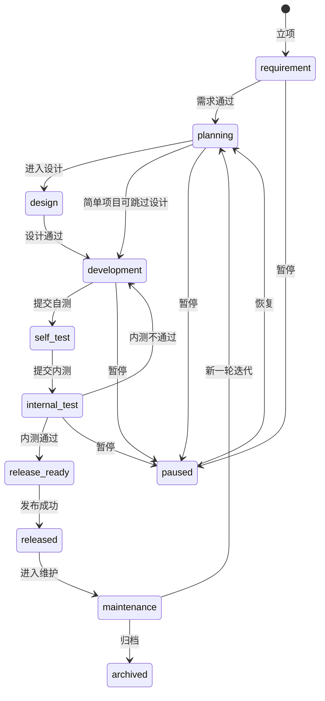

# 项目管理需求分析

最后更新时间：2026-05-15  
当前状态：需求已整理并进入基础版实现；项目仪表盘、项目概览、需求、迭代、里程碑、只读看板已完成代码落地，待迁移、seed 和类型检查后验收

## 1. 背景与目标

当前 Bug 反馈系统已经覆盖 Bug 提交、处理、验证、关闭、项目配置、模块、版本、成员、附件、评论和基础统计。随着项目推进，需要进一步补充项目管理能力，让团队不仅能管理 Bug，也能管理项目从需求到发布的完整推进过程。

本次新增需求目标是：

1. 管理项目开发进度。
2. 管理下一阶段项目安排。
3. 管理需求池、需求评审、需求排期和需求验收。
4. 标识项目当前阶段，例如需求阶段、开发阶段、内测阶段、发布阶段。
5. 让项目负责人能看到项目细节、风险和待处理事项。
6. 让老板或管理层通过独立看板实时了解项目进度，放心安排工程进度和资源。

系统建议定位升级为：

> 内部轻量级研发项目协作平台，以 Bug 闭环为基础，补充需求、迭代、里程碑、项目阶段、进度统计和项目仪表盘。

## 2. 已确认需求

| 项目 | 结论 |
|---|---|
| 使用对象 | 内部团队、项目负责人、产品、开发、测试、管理层 |
| 功能范围 | 在现有 Bug 反馈系统基础上补充项目管理功能 |
| 项目阶段 | 需要区分开发阶段、内测阶段等项目阶段 |
| 需求管理 | 需要管理需求、需求状态、需求排期和验收 |
| 下阶段安排 | 需要看到未来要进入开发、内测、发布的项目安排 |
| 老板看板 | 需要管理层实时看到项目进度、风险、延期、下一步安排、当前开发处理事项、历史完成和未处理事项 |
| 第一版原则 | 轻量可用，避免一次性做成完整 Jira/禅道 |
| 通知提醒 | 暂不作为第一优先级，可后续扩展 |

## 3. 需求范围

### 3.1 第一版范围内

第一版建议实现以下能力：

1. 项目阶段管理。
2. 项目计划开始时间、计划结束时间、风险等级和风险说明。
3. 需求管理。
4. 需求状态流转。
5. 需求评审和排期。
6. 需求关联项目、模块、版本、迭代、里程碑和 Bug。
7. 迭代管理。
8. 里程碑管理。
9. 项目概览页，面向项目负责人。
10. 项目仪表盘，面向管理层。
11. 项目看板，至少支持需求和 Bug 按状态展示。
12. 项目进度统计、需求完成率、Bug 关闭率、延期和风险统计。
13. 当前开发处理中的需求和 Bug 数量及明细。
14. 历史完成的需求和已修复 Bug 数量及明细。
15. 未处理的需求和 Bug 数量及明细。
16. 操作历史和项目动态。
17. 基于 RBAC 的菜单、按钮和数据范围控制。

### 3.2 第一版范围外

第一版建议暂不实现：

1. 完整甘特图和复杂依赖网络。
2. 自动排期。
3. 工时日报和成本管理。
4. WIP 限制。
5. WebSocket 实时大屏推送。
6. 外部客户需求门户。
7. 管理层周报自动生成和导出。
8. 跨项目组合或项目集管理。
9. AI 自动分析项目风险或自动生成排期。

## 4. 用户角色

| 角色 | 主要目标 | 核心关注点 |
|---|---|---|
| 管理层 | 快速了解项目整体进展并安排资源 | 哪些项目正常、哪些延期、哪些需要协调、下阶段怎么排 |
| 项目负责人 | 推动项目按计划完成 | 阶段、需求、迭代、里程碑、风险、成员协作 |
| 产品负责人 | 管理需求价值、范围和验收 | 需求池、评审、优先级、排期、验收标准 |
| 开发人员 | 完成需求开发和 Bug 修复 | 分配给自己的需求、任务、Bug、截止时间 |
| 测试人员 | 验证需求和缺陷修复 | 测试范围、内测阶段、阻断 Bug、验证结果 |
| 系统管理员 | 维护用户、权限、菜单、配置 | 权限、字典、基础配置 |
| 普通成员 | 提交或查看自己参与的需求和 Bug | 参与事项、反馈进度 |

## 5. 项目阶段需求

### 5.1 阶段列表

建议项目阶段独立于项目启用/停用状态。

| 阶段值 | 显示名 | 含义 |
|---|---|---|
| requirement | 需求阶段 | 正在收集、澄清和评审需求 |
| planning | 规划阶段 | 正在确认范围、排期、人员和版本计划 |
| design | 设计阶段 | 正在进行产品、交互、技术或数据库设计 |
| development | 开发阶段 | 开发正在实现需求和修复 Bug |
| self_test | 自测阶段 | 开发完成后进行自测和联调 |
| internal_test | 内测阶段 | 测试或内部用户正在验证 |
| release_ready | 待发布 | 已满足上线条件，等待发布窗口 |
| released | 已发布 | 项目或版本已经交付上线 |
| maintenance | 维护阶段 | 上线后维护、小需求和缺陷修复 |
| paused | 已暂停 | 项目因资源、范围或外部原因暂停 |
| archived | 已归档 | 项目结束，不再活跃推进 |

### 5.2 阶段流转



### 5.3 阶段操作要求

1. 项目阶段只能由系统管理员、项目负责人或授权角色修改。
2. 每次阶段变化必须记录操作人、操作时间、原阶段、新阶段和说明。
3. 阶段变更应影响项目仪表盘、项目概览、路线图和下阶段安排。
4. 阶段流转规则建议集中配置，不要散落在页面逻辑中。

## 6. 需求管理需求

### 6.1 需求状态

| 状态值 | 显示名 | 含义 |
|---|---|---|
| draft | 草稿 | 需求刚创建，信息未完整 |
| submitted | 已提交 | 等待评审 |
| reviewing | 评审中 | 正在确认价值、范围和可行性 |
| approved | 已通过 | 需求有效但未排期 |
| rejected | 已驳回 | 不纳入当前范围 |
| deferred | 已延期 | 有价值但暂不做 |
| planned | 已排期 | 已进入迭代、里程碑或目标版本 |
| developing | 开发中 | 正在开发 |
| testing | 测试中 | 正在测试或内测 |
| accepted | 已验收 | 验收通过 |
| released | 已发布 | 已随版本发布 |
| closed | 已关闭 | 生命周期结束 |
| changed | 变更中 | 范围变化，需要重新评审 |

### 6.2 需求字段

| 字段 | 是否必填 | 说明 |
|---|---|---|
| 需求标题 | 是 | 简洁描述需求目标 |
| 所属项目 | 是 | 关联项目 |
| 所属模块 | 否 | 关联项目模块 |
| 需求类型 | 是 | 新功能、优化、技术、安全等 |
| 需求来源 | 否 | 内部、老板、运营、测试、客户、数据分析等 |
| 优先级 | 是 | 紧急、高、中、低 |
| 业务价值 | 否 | 高、中、低或数字评分 |
| 实现难度 | 否 | 高、中、低或故事点 |
| 状态 | 是 | 当前需求状态 |
| 需求负责人 | 否 | 产品或需求负责人 |
| 开发负责人 | 否 | 进入开发后填写 |
| 测试负责人 | 否 | 进入测试后填写 |
| 迭代 | 否 | 需求所属迭代 |
| 里程碑 | 否 | 需求关联里程碑 |
| 目标版本 | 否 | 需求计划发布版本 |
| 计划开始时间 | 否 | 排期参考 |
| 计划完成时间 | 否 | 排期参考 |
| 实际完成时间 | 否 | 验收或发布时记录 |
| 需求描述 | 是 | 背景、目标、范围 |
| 验收标准 | 是 | 可验证的完成条件 |
| 备注 | 否 | 其他说明 |

### 6.3 需求评审要求

需求通过评审前需要确认：

1. 需求价值是否明确。
2. 是否属于当前项目范围。
3. 是否有清晰验收标准。
4. 是否能拆分到一个迭代内交付。
5. 是否存在依赖项或阻塞项。
6. 是否需要关联已有 Bug、版本或历史需求。

## 7. 迭代与里程碑需求

### 7.1 迭代管理

迭代用于管理一段周期内要交付的需求、任务和 Bug。第一版建议支持：

1. 创建迭代。
2. 设置迭代目标。
3. 设置开始时间、结束时间和负责人。
4. 维护迭代范围，包括需求和 Bug。
5. 查看迭代进度、需求完成情况和 Bug 关闭情况。
6. 支持迭代状态流转：未开始、进行中、测试中、已完成、已暂停、已取消。

### 7.2 里程碑管理

里程碑用于管理项目关键节点。第一版建议支持：

1. 创建里程碑。
2. 设置里程碑名称、目标日期、负责人和完成条件。
3. 关联项目阶段，例如开发完成、内测开始、上线发布。
4. 关联需求和阻断 Bug。
5. 统计里程碑完成率和延期状态。
6. 在项目仪表盘和项目概览中展示关键里程碑。

## 8. 项目负责人概览需求

项目概览页面向项目负责人，目标是方便负责人推进项目。

建议展示：

1. 项目基础信息。
2. 当前项目阶段和阶段流转操作。
3. 计划开始时间、计划完成时间、剩余天数。
4. 项目进度、需求完成率、Bug 关闭率。
5. 当前迭代摘要。
6. 下一个里程碑。
7. 高风险需求。
8. 阻断 Bug。
9. 最近项目动态。
10. 下一步待处理事项。
11. 当前开发正在处理的需求列表和数量。
12. 当前开发正在修复的 Bug 列表和数量。
13. 历史已完成需求、已修复 Bug 的数量和明细入口。
14. 未处理需求、未处理 Bug 的数量和明细入口。

## 9. 项目仪表盘需求

项目仪表盘面向老板或管理层，目标是让管理层实时看到项目整体进展、风险和下阶段安排，从而放心安排工程进度。

### 9.1 看板目标

老板打开看板后，应能在 30 秒内回答：

1. 当前有多少项目正在推进。
2. 哪些项目正常，哪些项目存在风险或已经延期。
3. 每个项目处于需求、开发、内测、发布中的哪个阶段。
4. 关键里程碑是否能按期完成。
5. 未来 7/14/30 天有哪些项目要进入开发、内测或发布。
6. 是否需要协调资源、调整范围或延后发布日期。
7. 哪些阻断 Bug 或高优先级需求影响工程进度。
8. 开发现在正在处理哪些需求、正在修复哪些 Bug。
9. 历史已经完成多少需求、修复多少 Bug。
10. 还有多少需求和 Bug 没处理。

### 9.2 看板核心模块

| 模块 | 说明 |
|---|---|
| 全局筛选 | 时间范围、项目阶段、负责人、风险等级 |
| 总览指标 | 项目总数、正常推进、风险项目、已延期、即将发布、处理中需求、修复中 Bug、未处理事项 |
| 项目健康度列表 | 项目、负责人、阶段、计划完成日、进度、风险等级、下一动作 |
| 当前处理事项 | 当前开发正在处理的需求和修复中的 Bug，支持按项目、负责人、阶段下钻 |
| 历史完成事项 | 已完成需求、已修复 Bug 的数量趋势和明细入口 |
| 未处理事项 | 未处理需求、未处理 Bug 的数量、优先级分布和最久未处理时长 |
| 风险雷达 | 阻断 Bug、延期需求、人员负载异常、里程碑临近未完成 |
| 下阶段安排 | 未来 7/14/30 天进入开发、内测、发布的项目 |
| 里程碑时间线 | 按日期展示开发完成、内测开始、发布上线等节点 |
| 管理层行动建议 | 系统根据风险规则生成需要关注或协调的事项 |

### 9.3 核心指标

| 指标 | 含义 | 管理价值 |
|---|---|---|
| 项目总数 | 当前可见项目数量 | 了解工程盘子大小 |
| 正常推进项目数 | 无延期、无高风险阻塞的项目数量 | 判断哪些项目无需干预 |
| 风险项目数 | 存在阻断、延期或质量风险的项目数量 | 判断哪些项目需要关注 |
| 已延期项目数 | 超过计划完成日仍未完成的项目数量 | 暴露排期问题 |
| 平均项目进度 | 进行中项目平均进度 | 判断整体推进速度 |
| 需求完成率 | 已验收、已发布或已关闭需求占比 | 判断范围完成情况 |
| 当前处理中需求数 | 状态为开发中/测试中等正在推进的需求数 | 判断开发当前工作负载 |
| 未处理需求数 | 已提交/已通过但尚未排期或未开始的需求数 | 判断需求积压情况 |
| 历史完成需求数 | 指定时间范围内已验收、已发布或已关闭的需求数 | 判断历史交付效率 |
| Bug 关闭率 | 已关闭 Bug 占比 | 判断质量收敛情况 |
| 当前修复中 Bug 数 | 状态为已分配、修复中或待验证的 Bug 数 | 判断缺陷处理压力 |
| 未处理 Bug 数 | 待确认、已确认但未开始修复的 Bug 数 | 判断缺陷积压情况 |
| 历史已修复 Bug 数 | 指定时间范围内已关闭的 Bug 数 | 判断历史修复效率 |
| 阻断 Bug 数 | 严重/致命且未关闭 Bug 数 | 判断是否影响内测或发布 |
| 里程碑准时率 | 按期完成的里程碑占比 | 判断排期可信度 |
| 未来关键节点 | 未来 7/14/30 天到期或进入下一阶段事项 | 方便提前安排资源 |

### 9.4 项目健康度

| 健康度 | 显示名 | 判定建议 | 处理建议 |
|---|---|---|---|
| healthy | 正常 | 进度不落后、无阻断 Bug、里程碑未延期 | 无需干预 |
| watch | 关注 | 进度轻微落后或关键节点临近但完成率偏低 | 项目负责人跟进 |
| risk | 高风险 | 有阻断 Bug、延期需求、人员负载异常或里程碑可能延期 | 管理层关注 |
| delayed | 已延期 | 超过计划完成日或关键里程碑延期 | 调整排期或资源 |
| paused | 已暂停 | 项目阶段为暂停 | 明确恢复条件 |

### 9.5 风险规则

| 风险类型 | 触发条件 | 看板提示 |
|---|---|---|
| 里程碑临近 | 里程碑 7 天内到期，完成率低于 80% | 里程碑临近，完成率偏低 |
| 里程碑延期 | 当前日期超过目标日期且未完成 | 里程碑已延期 N 天 |
| 阻断 Bug | 存在严重/致命且未关闭 Bug | 存在 N 个阻断 Bug |
| 内测质量风险 | 内测阶段 Bug 关闭率低于 80% | 内测 Bug 未收敛 |
| 需求膨胀 | 迭代开始后新增需求超过阈值 | 迭代范围持续扩大 |
| 无负责人 | 项目、需求或阻断 Bug 无负责人 | 关键事项无人负责 |
| 长时间无更新 | 项目超过 N 天无动态 | 项目近期无更新 |
| 计划缺失 | 无计划完成日或无下一里程碑 | 缺少明确交付节点 |

风险阈值需要配置化，例如临近天数、Bug 关闭率阈值、长时间无更新天数等。

### 9.6 实时性要求

第一版不强制 WebSocket。建议采用：

1. 后端聚合接口实时查询或短缓存。
2. 前端每 1～5 分钟自动刷新。
3. 支持手动刷新。
4. 明确展示最后更新时间。
5. 后续如用于电视大屏，再扩展 WebSocket 或 Server-Sent Events。

### 9.7 低保真页面结构

```text
┌────────────────────────────────────────────────────────────┐
│ 项目仪表盘                         自动刷新：1分钟前  [刷新] │
│ 时间：本月  阶段：全部  负责人：全部  风险：全部             │
├──────────┬──────────┬──────────┬──────────┬──────────┤
│ 进行中项目 │ 正常推进  │ 风险项目  │ 已延期   │ 7天关键节点 │
├────────────────────────────────────────────────────────────┤
│ 项目健康度                                                   │
│ 项目        阶段     进度    负责人  计划完成   风险   下一动作 │
├────────────────────────────────────────────────────────────┤
│ 左：里程碑时间线                  右：风险与阻塞事项          │
├────────────────────────────────────────────────────────────┤
│ 下阶段安排：未来7天 / 14天 / 30天                            │
├────────────────────────────────────────────────────────────┤
│ 管理层行动建议                                                │
└────────────────────────────────────────────────────────────┘
```


### 9.8 当前处理、历史完成和未处理事项

项目负责人和管理层都需要看到开发当前在处理什么、历史已经完成什么、还剩什么没处理。区别在于：

1. 项目负责人看单项目或自己负责项目的细节，重点用于推进。
2. 管理层看全部项目或授权项目的摘要，重点用于资源安排和风险判断。

#### 9.8.1 当前处理事项

当前处理事项用于回答“开发现在正在干什么”。

| 类型 | 统计口径 | 需要展示的明细 |
|---|---|---|
| 当前处理中需求 | 需求状态为 `developing`、`testing`，或已进入当前迭代且未完成 | 需求编号、标题、项目、模块、负责人、状态、优先级、计划完成时间 |
| 当前修复中 Bug | Bug 状态为 `assigned`、`fixing`、`pending_verify`，或已分配给开发且未关闭 | Bug 编号、标题、项目、模块、负责人、严重程度、优先级、状态、预计完成时间 |

建议支持筛选：项目、项目负责人、开发负责人、阶段、优先级、状态、时间范围。

#### 9.8.2 历史完成事项

历史完成事项用于回答“过去完成了多少”。

| 类型 | 统计口径 | 需要展示的明细 |
|---|---|---|
| 历史完成需求 | 指定时间范围内状态进入 `accepted`、`released`、`closed` 的需求 | 需求编号、标题、项目、负责人、完成时间、目标版本 |
| 历史修复 Bug | 指定时间范围内状态进入 `closed` 的 Bug | Bug 编号、标题、项目、负责人、关闭时间、修复说明 |

默认时间范围建议：本周、本月、本季度、自定义。项目仪表盘默认看本月，项目负责人概览默认看当前迭代。

#### 9.8.3 未处理事项

未处理事项用于回答“还欠多少没处理”。

| 类型 | 统计口径 | 需要展示的明细 |
|---|---|---|
| 未处理需求 | 已提交、已通过但未排期，或已排期但未开始开发的需求 | 需求编号、标题、项目、优先级、停留天数、负责人 |
| 未处理 Bug | `pending_confirm`、`confirmed`，或没有进入修复中的 Bug | Bug 编号、标题、项目、严重程度、优先级、停留天数、当前负责人 |

未处理事项需要按优先级和停留时间排序，严重/紧急事项排在前面。

#### 9.8.4 展示要求

1. 项目仪表盘展示汇总数量和 Top 风险项，支持点击下钻到明细。
2. 项目负责人概览展示完整列表或分页列表，便于直接推进。
3. 每个统计卡片都必须能解释口径，避免“数量看起来不可信”。
4. 明细需要支持导出可后续扩展，第一版只预留入口。
5. 数量统计不能只看当前登录人，应根据角色权限和项目数据范围过滤。

## 10. 项目看板需求

第一版建议支持三类看板：

| 看板 | 列 | 卡片 |
|---|---|---|
| 需求看板 | 草稿、评审中、已通过、已排期、开发中、测试中、已验收 | 需求 |
| Bug 看板 | 待确认、已确认、已分配、修复中、待验证、已关闭 | Bug |
| 迭代看板 | 待处理、进行中、测试中、已完成 | 需求 + Bug，后续可加任务 |

第一版不强制拖拽状态，建议先用详情操作或快捷按钮流转状态，降低实现风险。

## 11. 进度计算需求

### 11.1 项目进度

优先按需求完成情况计算：

```text
项目进度 = 已完成需求数量 / 全部有效需求数量
```

需求完成状态包括：

```text
accepted / released / closed
```

如后续启用权重或故事点，可改为：

```text
项目进度 = 已完成需求权重 / 全部需求权重
```

### 11.2 Bug 关闭率

```text
Bug 关闭率 = 已关闭 Bug 数 / 全部有效 Bug 数
```

### 11.3 当前/历史/未处理统计口径

| 分类 | 需求口径 | Bug 口径 |
|---|---|---|
| 当前处理中 | `developing`、`testing`，或当前迭代内未完成 | `assigned`、`fixing`、`pending_verify` |
| 历史完成 | 时间范围内进入 `accepted`、`released`、`closed` | 时间范围内进入 `closed` |
| 未处理 | `submitted`、`approved`、`planned` 但未开始开发 | `pending_confirm`、`confirmed` 且未进入修复 |

实际实现时应以项目状态流转配置为准，避免在统计代码中写死状态。

### 11.4 综合健康度

项目仪表盘不要只看进度百分比，建议综合以下因素：

1. 进度偏差。
2. 里程碑偏差。
3. 阻断 Bug。
4. 需求变更。
5. 最近活跃度。
6. 负责人是否明确。

指标权重和风险阈值应集中配置。

## 12. 权限需求

| 权限点 | 说明 |
|---|---|
| pm:project:view | 查看项目管理信息 |
| pm:project:update | 编辑项目阶段、日期、风险、成员等 |
| pm:requirement:view | 查看需求 |
| pm:requirement:create | 创建需求 |
| pm:requirement:update | 编辑需求 |
| pm:requirement:review | 评审需求 |
| pm:requirement:status | 流转需求状态 |
| pm:iteration:view | 查看迭代 |
| pm:iteration:manage | 管理迭代 |
| pm:milestone:view | 查看里程碑 |
| pm:milestone:manage | 管理里程碑 |
| pm:task:view | 查看任务，后续扩展 |
| pm:task:manage | 管理任务，后续扩展 |
| pm:dashboard:view | 查看项目统计和路线图 |
| pm:executive-dashboard:view | 查看项目仪表盘 |
| pm:executive-dashboard:all | 查看全部项目仪表盘 |
| pm:executive-dashboard:export | 导出管理层周报，后续扩展 |

### 12.1 管理层权限

1. 项目仪表盘默认只读。
2. 管理层可以查看全部项目或授权项目摘要。
3. 是否允许下钻查看需求和 Bug 详情，需要由系统权限控制。
4. 普通成员不应看到全局项目仪表盘。

## 13. 非功能需求

### 13.1 可用性

1. 项目仪表盘必须信息清晰，30 秒内能看懂项目状态。
2. 项目负责人页面需要可操作，老板页面以只读摘要为主。
3. 风险不能只用颜色表达，必须有文字说明。
4. 关键指标需要支持下钻，方便追溯来源。

### 13.2 实时性

1. 第一版允许 1～5 分钟内的数据延迟。
2. 页面必须显示最后更新时间。
3. 页面必须支持手动刷新。
4. 后续如需要大屏，可扩展 WebSocket/SSE。

### 13.3 安全性

1. 所有接口必须鉴权。
2. 全局仪表盘必须有独立权限控制。
3. 项目数据需要按权限范围过滤。
4. 需求、项目阶段、迭代、里程碑变更必须记录操作历史。

### 13.4 可扩展性

1. 项目阶段、需求状态、风险阈值、健康度规则需要配置化。
2. 第一版不做任务管理也要预留需求拆任务的扩展空间。
3. 项目仪表盘接口应使用聚合数据结构，方便后续增加周报、大屏和导出。

## 14. 数据对象草案

第一版建议包含或扩展以下对象：

1. BugProject：扩展项目阶段、计划时间、风险等级、风险说明、进度。
2. ProjectRequirement：新增需求对象。
3. ProjectIteration：新增迭代对象。
4. ProjectMilestone：新增里程碑对象。
5. ProjectActivity：新增项目动态或操作历史。
6. BugTicket：扩展关联需求、迭代、里程碑。
7. ProjectTask：任务对象，第一版可暂缓，后续扩展。

## 15. 推荐菜单结构

```text
Bug 管理
├── Bug 列表
├── 我的 Bug
└── 提交 Bug

项目管理
├── 项目仪表盘
├── 项目概览
├── 需求管理
├── 迭代计划
├── 里程碑
├── 项目看板
├── 项目配置
├── 模块管理
├── 版本管理
├── Bug 看板
├── 我的任务（后续）
└── 项目统计（后续）
```

## 16. 验收标准草案

第一版完成后至少满足：

1. 管理员或项目负责人可以维护项目阶段、计划时间、风险等级和风险说明。
2. 项目阶段可以流转，并记录操作历史。
3. 产品或项目负责人可以创建、编辑、评审和排期需求。
4. 需求可以完成从草稿到发布/关闭的状态流转。
5. 需求可以关联项目、模块、版本、迭代、里程碑和 Bug。
6. 项目负责人可以创建迭代并查看迭代进度。
7. 项目负责人可以创建里程碑并查看完成率和延期状态。
8. 项目概览页可以展示当前阶段、需求完成率、Bug 关闭率、当前迭代、下一里程碑和风险项。
9. 项目仪表盘可以展示全局项目进度、健康度、风险项目、延期项目、下阶段安排和管理层行动建议。
10. 项目仪表盘可以展示当前开发正在处理的需求数和明细入口、当前修复中的 Bug 数和明细入口。
11. 项目仪表盘可以展示指定时间范围内历史完成需求数、历史修复 Bug 数和明细入口。
12. 项目仪表盘可以展示未处理需求数、未处理 Bug 数，并按优先级和停留时间提示风险。
13. 项目负责人概览可以展示自己负责项目内当前处理、历史完成、未处理的需求和 Bug 列表。
14. 项目仪表盘展示最后更新时间，并支持手动刷新或定时刷新。
15. 项目看板可以按状态展示需求和 Bug。
16. 普通成员不能访问全局项目仪表盘。
17. 所有新增接口必须接入鉴权、权限守卫、Swagger、业务异常和日志体系。
18. 新增页面和后端文件必须按模块拆分，避免单个自有代码文件超过 500 行。

## 17. 风险与注意事项

| 风险 | 说明 | 建议 |
|---|---|---|
| 功能范围膨胀 | 项目管理容易越做越重 | 第一版只做需求、迭代、里程碑、阶段、项目仪表盘和基础统计 |
| 进度失真 | 单纯按数量计算可能不准确 | 第一版先数量统计，预留权重和故事点 |
| 老板看板误导决策 | 指标口径不清会导致误判 | 所有指标需要可解释、可下钻、有最后更新时间 |
| 当前/历史/未处理统计口径混乱 | 不同状态被重复统计或漏统计 | 统一通过状态配置定义统计分组，不在页面中硬编码 |
| 状态硬编码 | 后续项目阶段和需求状态会变化 | 使用字典或集中配置驱动 |
| 权限边界不清 | 管理层与项目成员权限不同 | 单独设计仪表盘权限和数据范围 |
| 实时性过度设计 | 一开始上 WebSocket 会增加复杂度 | 第一版用聚合接口、短缓存和定时刷新 |

## 18. 待确认问题

进入设计和开发前建议确认：

1. 项目仪表盘是否默认查看全部项目，还是只查看指定项目/部门？
2. 项目阶段是否采用本文建议的 11 个阶段，还是简化为需求、开发、内测、发布、维护、归档？
3. 第一版是否需要任务管理，还是先只做需求 + Bug + 迭代 + 里程碑？
4. 项目仪表盘自动刷新频率采用 1 分钟、3 分钟还是 5 分钟？建议默认 3～5 分钟。
5. 项目进度第一版按需求数量计算，还是需要权重/故事点？建议先按数量，预留权重字段。
6. 项目看板第一版是否需要拖拽？建议先不做拖拽。
7. 管理层周报导出是否放到二期？建议二期实现。
8. 是否需要通知提醒？建议第一版不做，后续根据使用反馈扩展。
9. 当前处理中需求是否包含“测试中”需求？建议包含，因为仍未最终交付。
10. 当前修复中 Bug 是否包含“待验证”Bug？建议包含，因为尚未关闭。
11. 历史完成默认时间范围是本周、本月还是当前迭代？建议老板看本月，项目负责人看当前迭代。

## 19. 下一步建议

建议下一阶段进入：

**阶段 2：用户、角色、权限和场景设计**

输出内容包括：

1. 管理层、项目负责人、产品、开发、测试等角色权限矩阵。
2. 项目仪表盘数据可见范围。
3. 项目阶段操作权限。
4. 需求评审和状态流转权限。
5. 迭代、里程碑、项目看板和统计权限。
